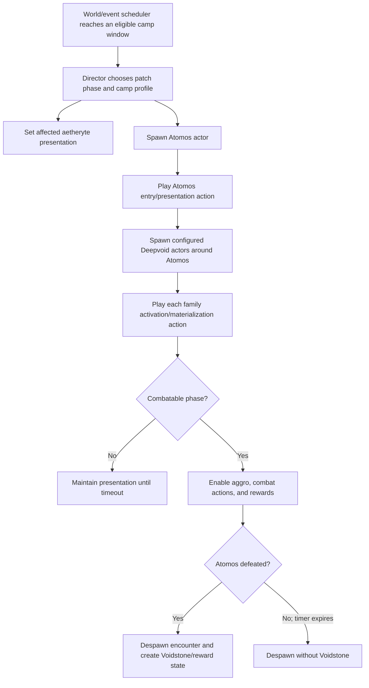

# FFXIV 1.x Atomos / Deepvoid summoning and aetheryte-drain decomp

> **Superseded asset findings (2026-09-07):** The follow-up decomp identifies
> the Deepvoid aura exactly, corrects the appearance column mapping, recovers
> the aetheryte's embedded motion and authored orange variant, and expands the
> Atomos state/action graph. Use
> [`outputs/atomos-deepvoid-decomp-20260907/README.md`](../outputs/atomos-deepvoid-decomp-20260907/README.md)
> for current conclusions. The historical event research and missing
> server/director boundary in this document remain useful.

Date: 2026-07-29  
Scope: the Seventh Umbral Era Atomos camp event in FFXIV 1.0/1.23a–1.23b, with emphasis on the client actors, animation banks, VFX attachments, Deepvoid materialization, and the affected camp aetherytes.

## Short answer

The surviving client does **not** contain a Lua function in which Atomos literally calls `summon(Deepvoid...)`. The recovered `*Animaobj` Lua classes are empty wrappers. The most defensible reconstruction is that an authoritative world/event director:

1. selected an eligible aetheryte camp and event phase;
2. spawned Atomos and a configured Deepvoid group as separate actors;
3. instructed those actors to play presentation/action banks;
4. applied an orange/drained aetheryte presentation and cross-actor VFX;
5. removed the encounter on timeout or Atomos death; and
6. spawned a Voidstone/reward state after a successful kill.

The client assets strongly support this architecture, but the original server-side director, spawn coordinates, wave timing, and skill-to-animation bindings are not present in the recovered data.

The best **candidate** for the visible aether-drain/tether action is Atomos `WSS0003`: it is the only Atomos bank whose recovered clip graph explicitly contains an actor-to-actor effect channel (`RaptureEffectAtoBClip`), and it also has both caster- and target-side VFX. This is not yet an exact identification because the asset strings do not call it “drain,” and surviving footage does not show the beginning of the event clearly enough to correlate a packet/action ID.

The camp crystal itself does not have a skeletal action bank. Its orange appearance is therefore much more likely to have been a model/material/VFX state or the target of an Atomos effect than a bone animation in which the aetheryte physically moved.

The summoned Deepvoid's visible glow should be preserved as a separate, actor-attached event presentation layer. `cbbm_activ` supplies the one-shot body motion; it should not replace the aura. Start the glow with materialization and keep it attached while the Deepvoid actor remains part of the Atomos encounter. The exact original glow resource has not yet been isolated, so that attachment must remain configurable until the A/B Animaobj variants can be compared live.

## Evidence labels used here

| Label | Meaning |
|---|---|
| **Confirmed — client** | Directly present in recovered SQL, Lua, model, or action-bank data. |
| **Confirmed — historical** | Stated in a contemporary Square Enix patch/hotfix record. |
| **Observed — footage** | Visible in surviving 1.x footage, but not necessarily sufficient to identify an asset ID. |
| **Strong candidate** | Multiple independent clues agree, but the original binding/director is missing. |
| **Unknown** | The surviving material cannot establish an exact answer. |

“Decomp” in this report means structural recovery of actor classes, resource identities, action-bank contents, clip types, VFX paths, and packet-facing bank IDs. It does not mean that every proprietary animation curve or VFX binary has been converted to editable source.

## Historical event phases

### Patch progression

| Phase | Confirmed behavior |
|---|---|
| 1.23a, August 2012 | Atomos appeared at Camp Brittlebark, Revenant's Toll, Ever Lakes, Glory, and Bluefog. The initial Deepvoid roster was Warrior, Scamp, and Soul. |
| 1.23b, September 2012 | Dragonhead, Emerald Moss, Crimson Bark, Black Brush, and Horizon were added. The original five camps became the hostile/zero-anima version of the event. Watcher, Pikeman, Wizard, Slave, and Sludge joined the roster at those camps. |
| September 14 hotfix | The first Atomos defeat alone awarded an Over-aspected Cluster; later defeats awarded an increased quantity of crystals. |
| September 20 hotfix | Combatable Atomos appearance frequency was reduced, and monsters stopped spawning around Atomos in low- and mid-level areas. |
| November 1 end-state | The additional five camps also became zero-anima destinations, and Deepvoid Butcher was added to the late event roster. |

Primary references:

- [Official Patch 1.23a notes](https://forum.square-enix.com/ffxiv/threads/51545-patch-1.23a-Patch-1.23a-Notes)
- [Official Patch 1.23b notes](https://forum.square-enix.com/ffxiv/threads/54142)
- [Official 1.x hotfix archive, page 3](https://forum.square-enix.com/ffxiv/threads/21283/?page=3)
- [Contemporary eLeMeN event archive](http://elemen.sakura.ne.jp/ff14_dated_archives/gamecontents/etc/TheseventhMoon%27sshade.html)
- Local historical synthesis: [seventh_moons_shade_event_archive.md](seventh_moons_shade_event_archive.md)

### Clock and lifetime reports

A contemporary player report describes combatable Atomos appearances at 18:00 and 00:00 Eorzea time at the orange/affected camps, noncombat appearances at 06:00 and 12:00 at the blue camps, and a lifetime a little longer than three Eorzea hours. It also reports that no Voidstone appeared if Atomos timed out rather than being defeated.

That report is useful for reconstruction, but it is secondary evidence. The official/eLeMeN event record explicitly documents the 00:00 appearance in the expanded event and does not fully establish all four reported time slots. Treat the 18:00/06:00/12:00 schedule and exact timeout as configurable hypotheses until packet logs or original server scripts are recovered.

Secondary reference: [Eyes on Final Fantasy — Patch 1.23b released](https://home.eyesonff.com/showthread.php/144893-FFXIV-Patch-1-23b-Released)

## What “Atomos summoned them” meant technically

No recovered client Lua class performs the spawning. Every relevant event wrapper only imports a base class and declares its identity:

- `AhrimanNormalAnimaobj` / `AhrimanNormalAnimaobjB`
- `LivingdeadLancerAnimaobj` / `LivingdeadLancerAnimaobjB`
- `LivingdeadThaumaturgeAnimaobj` / `LivingdeadThaumaturgeAnimaobjB`
- `SkeletonNormalAnimaobj` / `SkeletonNormalAnimaobjB`
- `OgreNormalAnimaobj` / `OgreNormalAnimaobjB`
- `ImpNormalAnimaobj` / `ImpNormalAnimaobjB`
- `FlanLesserStandardAnimaobj` / `FlanLesserStandardAnimaobjB`
- `GargoyleNormalAnimaobj` / `GargoyleNormalAnimaobjB`
- `PetitghostNormalAnimaobj` / `PetitghostNormalAnimaobjB`
- `AnimaobjNormalA`, `AnimaobjNormalB`, `AnimaobjNormalC`, `AnimaobjNormalD`, and `AnimaobjStandard` for Atomos
- `MonsterDirectorAnimaobj`

The wrappers contain no scheduling, coordinates, mob lists, action selection, or aetheryte logic. Even `MonsterDirectorAnimaobj.init` is empty in the recovered Lua. Its behavior must have lived in native client code, data that has not survived, or—most importantly for actual actor creation—the original server/world-event implementation.

There is also a data mismatch worth preserving: the imported actor-class SQL currently binds the named Deepvoid rows to ordinary `*Standard` family scripts, while the LPB recovery contains explicit `*Animaobj` and `*AnimaobjB` variants. This proves that event-specialized class identities existed, but does not prove which A/B lane a particular camp or patch phase used.

### Reconstructed control flow



The arrows describe the recovered architecture, not exact original frame timings.

## Atomos actor and model

### Actor identity

| Field | Recovered value |
|---|---|
| Actor-class range | `2111001`–`2111024` |
| Actor Lua family | `/Chara/Npc/Monster/Animaobj/AnimaobjStandard` |
| Display IDs | `3111001`–`3111004`, repeated across the class range |
| Appearance base | `10070` |
| Model resource | monster `m070` |
| Model folder spelling | `m070_atmos` — the asset folder uses one “o” |
| Size / body / legs | size `2`, body `0`, legs `1024` |
| Event behavior flag | the actor rows include `noticeEvent` |

All 24 recovered Atomos actor classes use the same main model family. Multiple actor/display identities therefore look like event states or behavior variants, not separate visible creature models.

### Baseline bank (`BID0000`)

**Confirmed — client.** The Atomos baseline bank contains:

- `cbbm_activ` and `cbbm_deact`;
- idle, locomotion, battle/normal state, and death-pose motions;
- caster VFX for skill 09:
  - `/vfx/mon/m070_atmos/.../m070sk9c0c`
  - `/vfx/mon/m070_atmos/.../m070sk9c1c`
- caster VFX for skill 10:
  - `/vfx/mon/m070_atmos/.../m070sk10c0c`
  - `/vfx/mon/m070_atmos/.../m070sk10c1c`
- effect and sound clips.

The baseline file is 591,664 bytes with SHA-256:

`7c7ebfca0ec0e96737bd4420762c317c79719c327d184523c451140af9cbbf2b`

`cbbm_activ` is the clearest candidate for Atomos's own initial appearance/activation motion. The bank alone does not show whether the original director used it at every spawn.

### Weapon-skill/action banks (`WSS0001`–`WSS0010`)

The packet-facing raw ID for a monster WSS bank follows:

```text
raw animation ID = 0x13000000 + (bank number * 0x1000)
```

For Atomos this yields `0x13001000` through `0x1300A000`.

| Bank | Raw ID | Recovered motion(s) | Attached VFX/clip structure | Interpretation |
|---|---:|---|---|---|
| `WSS0001` | `0x13001000` | `cbbm_sp_01` | skill 01 caster `c0`, middle `m0`, target `t0` | Full caster-to-middle-to-target action; exact use unknown. |
| `WSS0002` | `0x13002000` | `cbbm_sp_b01`, `cbbm_sp_b_2lp` | skill 02 caster `c0`, target `t0` | Looping B-variant action with target effect. |
| `WSS0003` | `0x13003000` | `cbbm_sp_a01`, `cbbm_sp_a_2lp` | skill 03 caster `c0/c1`, target `t0`; includes `RaptureEffectAtoBClip` | **Strongest drain/tether candidate** because it explicitly supports actor A to actor B. |
| `WSS0004` | `0x13004000` | `cbbm_sp_a02`, `cbbm_sp_a_2lp` | skill 04 caster `c0/c1`, target `t0` | A second looping A-variant with a target endpoint. |
| `WSS0005` | `0x13005000` | `cbbm_sp_02` | skill 05 caster `c0/c1`; no target VFX path recovered | Caster-centered action. |
| `WSS0006` | `0x13006000` | `cbbm_sp_03` | skill 06 caster `c0`, target `t0` | Targeted action; exact use unknown. |
| `WSS0007` | `0x13007000` | `cbbm_sp_04` | skill 07 caster `c0`; reuses skill 01 target `m070sk1t0c` | Possible follow-up/alternate phase sharing WSS1's target endpoint. |
| `WSS0008` | `0x13008000` | `cbbm_sp_04` | no effect paths in the bank | Motion/state-only version of the WSS7 pose. |
| `WSS0009` | `0x13009000` | no motion path recovered | control/substatus scheduling only | Likely state/control plumbing rather than a visible standalone attack. |
| `WSS0010` | `0x1300A000` | no motion path recovered | control-only structure | Likely state/control plumbing; its short active block differs from WSS9. |

Additional structural notes:

- `WSS0001`–`WSS0008` have a 9,000,000-unit outer envelope.
- WSS1–WSS7 contain effect/sound or explicit visual attachment structure; WSS8 is the same `sp_04` motion without the recovered effect paths.
- WSS1–WSS9 use a 600,000-unit active block in the recovered metadata; WSS10 uses 300,000 units.
- Interpreting these units as microseconds is plausible, but not proven by this extraction. Accordingly, they should not yet be published as exact second values.
- Atomos has no separate `BTL` or `MGC` bank in the installed action inventory. Its visible special behavior is concentrated in `BID` and `WSS`.

No recovered skill-list row binds human-readable Atomos mechanics to these WSS banks. The current reconstruction's Atomos BNPC row has skill-list `0`, so names such as “aether drain,” “summon,” or “void portal” cannot honestly be assigned to a bank from the database alone.

## Deepvoid roster decomp

### Actor/model mapping

| Deepvoid mob | Display ID | Representative actor class(es) | Model | Recovered loadout/state | Event-wrapper family |
|---|---:|---:|---|---|---|
| Deepvoid Watcher | `3101714` | `2101714`, `2101715` | `m029` Ahriman | size 7; body 5120; legs 1056 | `AhrimanNormalAnimaobj` / `B` |
| Deepvoid Pikeman | `3101819` | `2101819`, `2101821` | `m030` Living Dead | spear main hand `168822804`; body 5120; legs 1024 | `LivingdeadLancerAnimaobj` / `B` |
| Deepvoid Wizard | `3101820` | `2101820`, `2101822` | `m030` Living Dead | staff main hand `310379580`; body 5120; legs 1056 | `LivingdeadThaumaturgeAnimaobj` / `B` |
| Deepvoid Warrior | `3101910` | `2101910`, `2101911` | `m031` Skeleton | main `80741376`; off hand `32508968`; body 5120; legs 1024 | `SkeletonNormalAnimaobj` / `B` |
| Deepvoid Slave | `3102507` | `2102507`, `2102508` | `m037` Ogre | size 7; body 5120; legs 2048 | `OgreNormalAnimaobj` / `B` |
| Deepvoid Scamp | `3102612` | `2102612`, `2102613` | `m038` Imp | size 7; body 5120; legs 1056 | `ImpNormalAnimaobj` / `B` |
| Deepvoid Sludge | `3103405` | `2103405`, `2103406` | `m049` Flan | size 7; body 5120; legs 1024 | `FlanLesserStandardAnimaobj` / `B` |
| Deepvoid Butcher | `3103503` | `2103504`, `2103505` | `m054` Gargoyle | size 7; body 5120; legs 1056 | `GargoyleNormalAnimaobj` / `B` |
| Deepvoid Soul | `3104326` | `2104328`, `2104329` | `m505` Petitghost | size 7; body 5120; legs 1056 | `PetitghostNormalAnimaobj` / `B` |

Two traps in the data:

- `2103503` is another Gargoyle appearance, but its size/body state does not match the size-7 Deepvoid event lane as well as `2103504/05`.
- `2104326/27` exist, but the size-7 Deepvoid Soul presentation is represented by `2104328/29`, which still use display ID `3104326`.

### Installed animation inventory

Every Deepvoid model has a baseline `BID` bank containing the generic family motions, including `cbbm_activ` and `cbbm_deact`. Those activation/deactivation motions are the best recovered candidates for individual Deepvoid materialization and removal. They are shared family assets, however, so the inventory does not prove a bespoke “emerge from Atomos” animation.

| Model / mob | Installed banks |
|---|---|
| `m029` Watcher | `BID0000`, `BTL0001`, `MGC0001`–`0004`, `WSS0001`–`0007` |
| `m030` Pikeman | spear set `2sp_emp`: `BID0000/0001`, `BTL0001`–`0003`, `MGC0001`–`0004`, `WSS0001`–`0003`; common banks also present |
| `m030` Wizard | staff set `2st_emp`: `BID0000/0001`, `BTL0001`, `BTL0010`, `MGC0001`–`0004`, `WSS0001`–`0003`; common banks also present |
| `m031` Warrior | sword/shield set: `BID0000/0001`, `BTL0001`, `MGC0001`–`0004`, `WSS0001`–`0007`; common banks also present |
| `m037` Slave | `BID0000`, `BTL0001`, `MGC0001`–`0004`, `WSS0001`–`0008`, `WSS0101`–`0103` |
| `m038` Scamp | `BID0000`, `BTL0001`, `MGC0001`–`0004`, `WSS0001`–`0006` |
| `m049` Sludge | `BID0000`, `BTL0001`, `MGC0001`–`0004`, `WSS0001`–`0005` |
| `m054` Butcher | `BID0000`, `BTL0001`, `MGC0001`–`0004`, `WSS0001`–`0005`, `WSS0007`–`0011` |
| `m505` Soul | `BID0000`, `BTL0001`, `MGC0001`–`0004`, `WSS0001`–`0005` |

The Deepvoid monsters reused their base monster-family combat banks. The event-specific part is principally their class/appearance selection, A/B Animaobj identities, encounter placement, and activation/presentation—not a wholly separate combat animation set for every Deepvoid name.

## Aetheryte drain decomp

### The actual camp-aetheryte resource

The standard camp aetheryte actor family (`1280000` and related parent classes) uses:

| Field | Recovered value |
|---|---|
| Actor family | `/Chara/Npc/Object/Aetheryte/AetheryteParent` |
| Display ID | `4010014` |
| Main background-object resource | `b902` |
| Principal equipment/model variants | `e001` body 1024; `e002` body 2048 |
| Embedded visual resources | `b902a_vfx` and `b902_vfx` |
| External `/act/` bank | **None found** |

Because `b902` has no external action bank, there is no evidence of an aetheryte skeletal action specifically named or structured as “energy being sucked out.” The model carries static/persistent VFX references, and an external actor can also place a target effect on it.

Nearby resources `b903` and `b904` contain other crystal/aetheryte-like visual variants, but the recovered actor tables do not cleanly bind either one to the Atomos camp-drain state. They should be compared visually, not assumed to be “normal” and “depleted.”

### The orange state in surviving footage

Surviving battle footage begins after the event has already started:

- at roughly 00:10, the camp crystal is already orange;
- by roughly 00:12, Atomos is already hovering behind it, so his spawn transition is missed;
- through the fight, the crystal retains the same pose while battle and purple/void VFX occur around Atomos and the players;
- after Atomos disappears at roughly 01:42, the crystal is still visibly in the same orange presentation in that shot.

This supports a material/VFX-state implementation and shows no obvious bone deformation of the crystal. It does **not** reveal the exact instant or asset by which the orange state was applied.

Footage:

- [FFXIV Patch 1.23b — Atomos Battle](https://www.youtube.com/watch?v=mkbYeaUqcr4)
- The video is linked in this [official community retrospective thread](https://forum.square-enix.com/ffxiv/threads/303338-The-Rising-Event%21-1.0-Experience/page4), whose accompanying first-hand caption describes Atomos as ripping the camps' crystals of their aether.

### Most likely division of the effect

| Visual component | Best recovered explanation | Confidence |
|---|---|---|
| Crystal remains orange/affected | Event swaps or modifies a `b902` appearance/material/persistent VFX state | Strong candidate |
| Energy connection between Atomos and crystal | Atomos target-side VFX, with `WSS0003` the strongest candidate due to `RaptureEffectAtoBClip` | Strong candidate, not exact |
| Atomos hovering/posing during drain | One of the looping `sp_a`/`sp_b` WSS motions, probably WSS2–WSS4 | Candidate |
| Crystal physically moving | No supporting action bank or visible deformation found | Unlikely |
| Deepvoid emerging | Server actor spawn plus each monster family's one-shot `cbbm_activ` motion | Strong architectural candidate |
| Glow around summoned Deepvoid | Persistent actor-attached Animaobj/event VFX, started with materialization and retained until death/despawn | Required for a faithful reconstruction; exact resource ID unknown |

### The misleading “evil aetheryte gate” helper

Actor classes named `~~~evilaetherytegate~~~` (`1200377` and `1200397`) resolve to a `b998 e010` helper/resource, not the main `b902` camp crystal. `b998` is a generic aetherial interaction-point/helper family. One of its recovered actions uses a quest marker VFX (`/vfx/quest/man406/marker_bt`).

It may have been used as an invisible interaction or layout helper, but it is not evidence for the visible orange camp crystal or its drain animation. It should not be substituted for `b902` in a reconstruction without further layout proof.

## Recommended faithful reconstruction

This is the highest-fidelity implementation that the evidence currently supports without inventing exact bindings.

### Event data

Define each camp profile with:

- camp/world position and Atomos anchor;
- aetheryte actor/reference;
- patch/event phase;
- active Eorzea-time windows;
- combatable/noncombatable flag;
- Deepvoid spawn table and offsets;
- encounter lifetime;
- reward/Voidstone eligibility;
- aetheryte presentation state.

Keep the schedule and mob composition data-driven because both changed during 1.23b hotfixes.

### Start sequence

1. The world event director enters an eligible time window.
2. Apply the affected/orange state to the camp's `b902` aetheryte. Do not animate its skeleton.
3. Spawn Atomos using an appropriate `2111001`–`2111024` event class and appearance `10070`.
4. Play Atomos `BID` activation (`cbbm_activ`) if live testing confirms it looks like the historical entrance.
5. For the drain presentation, begin by testing `WSS0003` against the aetheryte as the target actor. Compare WSS2 and WSS4 as alternate looping presentations.
6. Spawn the configured Deepvoid actors at server-authored offsets around Atomos.
7. Attach the Deepvoid summon glow before revealing each actor, play its `BID` activation motion, and retain the glow for the actor's encounter lifetime. Treat the glow and `cbbm_activ` as independent layers: the former is persistent presentation, while the latter is the one-shot body motion. Keep the VFX resource configurable until live A/B Animaobj comparison identifies the original.
8. Enable or suppress aggro according to the camp/patch phase.

This intentionally treats the “summon” as coordinated server spawning. Do not make Deepvoid creation depend on the client finishing an Atomos animation; actor creation and rewards must remain authoritative.

### Combat, timeout, and death

- Let the Deepvoid use the ordinary combat banks of their underlying model families.
- Drive Atomos visible skills through WSS banks after their effects have been visually classified.
- On timeout, remove Atomos and the encounter group, including every attached Deepvoid glow, without creating a Voidstone.
- On Atomos death, create the Voidstone actor (`4010033`) and its reward state, then clean up the event group according to the reconstructed patch phase.
- Do not immediately restore the crystal merely because Atomos died; the surviving video still shows it orange after the kill. Tie restoration to the wider camp/event-state timer unless better evidence is recovered.

## Live verification plan

The structural decomp narrows the remaining problem to a small, testable matrix.

### 1. Add an Atomos animation-probe profile

The current `!mobanimation` command validates against configured model profiles and does not yet accept Atomos. Add a probe-only `m070` profile with WSS max `10`. This is preferable to claiming the existing command already supports him.

Then play:

```text
0x13001000
0x13002000
0x13003000
0x13004000
0x13005000
0x13006000
0x13007000
0x13008000
0x13009000
0x1300A000
```

Record each bank from a fixed camera with:

- no target;
- a normal target actor;
- a stationary target placed at the camp-aetheryte position.

WSS3 is confirmed as the drain only if its actor-to-actor channel produces the correct connection and orientation.

`!mobanimation` should be treated as animation-only. A future `!usemobskill` binding would be needed to reproduce mechanics plus animation, and the recovered Atomos skill list is currently empty.

### 2. Compare aetheryte appearances

Spawn and capture:

- the known `b902 e001` presentation;
- the known `b902 e002` presentation;
- `b903 e001`;
- `b904 e001`.

Compare them in identical lighting against the orange crystal visible in the linked footage. This will establish whether the orange look is an existing alternate model/material or requires an event tint/persistent effect.

### 3. Classify Deepvoid activation

For one instance of every model (`m029`, `m030`, `m031`, `m037`, `m038`, `m049`, `m054`, `m505`):

1. spawn hidden;
2. reveal and play `cbbm_activ`;
3. repeat with the A and B Animaobj class identities if those bindings can be restored;
4. compare any material/VFX difference frame by frame.

This is the quickest way to determine whether A/B means appearance/disappearance, hostile/nonhostile phase, or another event-state split.

## Exact unknowns still requiring new evidence

The following cannot be recovered exactly from the current Lua/SQL/action inventory:

- the original world-director script;
- camp-relative XYZ and facing for Atomos and every Deepvoid actor;
- exact spawn wave counts and delays;
- which `2111001`–`2111024` Atomos class was used by each camp/phase;
- the semantic distinction between Animaobj and AnimaobjB;
- the exact WSS bank used for the drain, summon presentation, and each Atomos combat skill;
- whether an event-level VFX was added on top of Deepvoid `cbbm_activ`;
- the exact resource or runtime tint responsible for the orange aetheryte;
- precise Eorzea-time windows beyond the officially documented portions;
- exact timeout length and cleanup ordering;
- whether the late November event changed presentation in addition to roster/reward rules.

Any implementation that supplies those values today is a reconstruction choice, not recovered fact.

## Local evidence index

| Evidence | Repository location |
|---|---|
| Actor class → Lua/display/appearance bindings | `Data/sql/gamedata_actor_class.sql` |
| Appearance → model/size/equipment data | `Data/sql/gamedata_actor_appearance.sql` |
| Recovered actor Lua wrappers | LPB recovery source inspected during this analysis; it is not currently vendored under this repository's `outputs/` tree |
| Installed model/action-bank inventory | `outputs/dungeon-animation-inventory-20260722/installed_action_banks.csv` |
| Atomos/BNPC skill-list gap | `outputs/bnpc-data-gap-audit-20260719/skill_list_gaps.csv` |
| Historical event synthesis and source excerpts | `docs/seventh_moons_shade_event_archive.md` |
| Current animation probe command | `Data/scripts/commands/gm/mobanimation.lua` |
| Current mechanics/action probe | `Data/scripts/commands/gm/usemobskill.lua` |

## Final confidence summary

| Question | Answer |
|---|---|
| Did Atomos's client Lua summon the Deepvoid? | **No evidence of that.** The wrappers are empty; server/director orchestration is the supported architecture. |
| Did the Deepvoid have special event identities? | **Yes.** A/B Animaobj wrappers survive for every family, although their exact binding/meaning is missing. |
| What animation did newly spawned Deepvoid probably use? | Their family `BID` `cbbm_activ`, possibly plus an event-level effect. |
| Which Atomos animation drained the crystal? | `WSS0003` is the strongest candidate, but requires live visual confirmation. |
| Did the aetheryte itself have a drain action bank? | **No external action bank was found.** |
| How was the orange/drained crystal likely produced? | A persistent model/material/VFX state on `b902`, potentially combined with an Atomos target/tether VFX. |
| Can the original event be reproduced exactly now? | The actors and animation/VFX test space are recoverable; exact scheduling, coordinates, bindings, and several state transitions require reconstruction or new server/packet evidence. |
