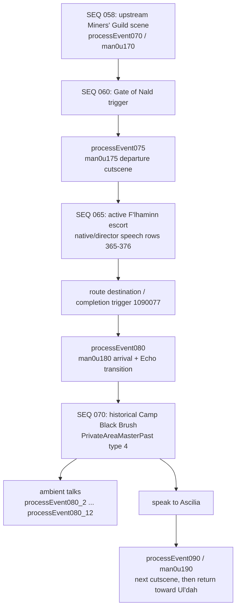

# Court in the Sands: F'lhaminn escort and adjacent cutscenes — deep decomp

**Quest:** `Court in the Sands`  
**Quest ID:** `110010`  
**Client quest class / text sheet:** `Man0u1` / `man0u1`  
**Requested slice:** Gate of Nald departure cutscene → active escort → Camp Black Brush arrival cutscene → immediately available historical-camp dialogue  
**Workspace snapshot:** 2026-08-13

## Executive result

The requested sequence is not one continuous cutscene. It is five distinct runtime surfaces:

1. `processEvent075` launches `man0u175`, the short Gate of Nald departure scene. It contains F'lhaminn's three spoken lines, the city-gate crowd choreography, and the party's walk-out.
2. The escort itself is director-driven, not an SCB cutscene. Its exact authored speech is in `man0u1` rows `365`–`376`: a route-opening warning, encounter/victory lines, health and failure branches, final-approach lines, and arrival confirmation.
3. `processEvent080` launches `man0u180`, the much larger Camp Black Brush scene. It begins as an arrival/commotion scene, then performs a deliberate present-to-past/Echo transition inside the asset: it swaps current F'lhaminn for `FLHAMINN_kako`, relocates the camp aetheryte, changes BGM, and stages the injured Ascilia/Corguevais encounter.
4. After `man0u180`, the player remains in historical private-area type `4`. The surrounding NPC conversations are separate client talk methods, `processEvent080_2` through `processEvent080_12`; they are not hidden dialogue inside the SCB.
5. Speaking to Ascilia then launches `processEvent090` / `man0u190`. That next scene is outside this decomp, but it is the actual continuation after exploring the historical camp.

The most important current-server finding is that the recorded route and four encounter stops exist, but there is no callback that invokes F'lhaminn's localized rows `365`–`376`. The generic `EscortRouteDirector` contains English diagnostic/status strings, and its current Court-specific filter suppresses the non-error ones; the result is a mostly silent quest route rather than F'lhaminn speaking at the beginning and at its stopping points. The current entry and completion paths also end the event before their after-warp transitions are performed, whereas both recovered client wrappers explicitly use `startFadeInCutSceneAfterWarp`.

## Evidence model and confidence notation

This document deliberately keeps different authorities separate.

| Mark | Meaning | Examples in this decomp |
|---|---|---|
| **A — exact** | Directly serialized or directly recovered from the installed client, recovered Lua, or text sheet | Actor dictionaries, clip records, coordinates, motion resource names, message IDs/text, `processEvent075`/`080` wrappers |
| **B — exact workspace snapshot** | Exact behavior/configuration in the current local server tree, but not proof of Square Enix's retail server behavior | The 174-waypoint route, four current Chinchilla encounters, synthetic completion-event owner, current system chat |
| **C — corroborated** | Visible in surviving gameplay footage or a period walkthrough/transcript | On-screen framing and wall-clock timestamps, moving-instance behavior, Chinchilla enemies |
| **I — inference** | Best explanation of exact evidence, but a missing native server/director implementation prevents a literal proof | The precise row-to-stop mapping for several escort victory variants; player-body accommodation branch semantics |

Two timing cautions apply throughout:

- SCB block durations are authored scheduler spans. Dialogue waits, player text advance, fades, and cross-block synchronization make wall-clock playback longer.
- Both PWIBs expose a `9.0 s` outer scheduler envelope. That is a container/default envelope, **not** the duration of either cutscene.

## Source inventory

### Primary local sources

- Recovered client quest Lua: [`tools/outputs/lpb/decomp_more_20260617/lua/quest/scenario/man/man0u1.lua`](../tools/outputs/lpb/decomp_more_20260617/lua/quest/scenario/man/man0u1.lua)
- Recovered retail director stub: [`tools/outputs/lpb/decomp_more_20260617/lua/director/quest/questdirectorman0u102.lua`](../tools/outputs/lpb/decomp_more_20260617/lua/director/quest/questdirectorman0u102.lua)
- Full localized quest text: [`docs/Dat Mining/man0u1.csv`](Dat%20Mining/man0u1.csv)
- Current quest integration: [`Data/scripts/quests/man/man0u1.lua`](../Data/scripts/quests/man/man0u1.lua)
- Current route monitor: [`Data/scripts/directors/Quest/QuestDirectorMan0u102.lua`](../Data/scripts/directors/Quest/QuestDirectorMan0u102.lua)
- Current generic route runtime: [`Map Server/Actors/Director/EscortRouteDirector.cs`](<../Map Server/Actors/Director/EscortRouteDirector.cs>)
- Current route capture: [`Data/escortnavmesh/court_in_the_sands.json`](../Data/escortnavmesh/court_in_the_sands.json)
- Installed primary cutscene assets:
  - `C:\Program Files (x86)\SquareEnix\FINAL FANTASY XIV\client\cut\man0u175\man0u175`
  - `C:\Program Files (x86)\SquareEnix\FINAL FANTASY XIV\client\cut\man0u180\man0u180`

### External corroboration

- The surviving [31:35 gameplay recording](https://www.youtube.com/watch?v=WlKVCvRgQs0) visually confirms the Gate scene and the entire Camp Black Brush scene. The uploader skips the escort gameplay itself.
- Gamer Escape's [historical transcript](https://ffxiv.gamerescape.com/wiki/Loremonger%3ACourt_in_the_Sands) independently preserves the escort speech corpus and surrounding story order. Its own warning that transcript text may include unused or altered lines is why the installed `man0u1` sheet remains the text authority here.
- A contemporary-style [quest walkthrough](https://www.alteredgamer.com/final-fantasy-14/95432-ffxiv-main-scenario-quest-walkthrough-court-in-the-sands/) describes the moving instance, F'lhaminn returning when she gets too far ahead, and low-HP Chinchilla attacks.
- The archived [quest journal/walkthrough](https://ffxiv.fandom.com/wiki/Court_in_the_Sands) confirms that the player speaks to Ascilia in the post-arrival instance to advance.

## Exact boundary and state flow



`man0u170` is upstream of the requested gate rendezvous. The direct pre-escort scene is `man0u175`; the direct post-escort scene is `man0u180`.

### Recovered client wrappers

The two methods are structurally identical and accept no scene-specific payload:

```lua
function Man0u1.processEvent075(A0_236, A1_237, A2_238)
  A0_236:startFadeOutCutSceneDefault(A1_237)
  A0_236:startNQCutScene("man0u175", 1)
  A0_236:startFadeInCutSceneAfterWarp(A1_237)
end

function Man0u1.processEvent080(A0_239, A1_240, A2_241)
  A0_239:startFadeOutCutSceneDefault(A1_240)
  A0_239:startNQCutScene("man0u180", 1)
  A0_239:startFadeInCutSceneAfterWarp(A1_240)
end
```

Both are therefore **context-only NQ scenes**:

- three formal arguments / three actual arguments;
- scene mode `1`;
- no character, branch, item, or result payload supplied by the quest Lua;
- `after_warp` fade-in semantics;
- the scene must obtain its actors and choreography from the SCB plus the active quest/world context.

### Replay rows

| Replay row | Scene | Replay label | c6 | c7 | c8–c15 |
|---:|---|---|---:|---:|---|
| `11001010` | `man0u175` | Cutscene 10 | `1` | `1` | all `-200` placeholder/default |
| `11001011` | `man0u180` | Cutscene 11 | `1` | `1` | all `-200` placeholder/default |

No replay parameter supplies the escort result, player race, or dialogue choice. The post-scene's internal `GetActorNumber`/`IfClip` system handles presentation accommodation from client-visible actor context.

## Installed asset identity

| Scene | Physical bytes | File timestamp | SHA-256 | Embedded SCB offset | SCB bytes | SCB SHA-256 |
|---|---:|---|---|---:|---:|---|
| `man0u175` | `30,752` | 2010-06-20 00:52:38 | `12e83457a1f15491f19add5acefed9fb37f98d6a53e6efd775252d619153079e` | `0x80` | `30,512` | `371e217eb1e29482770b17d9fc8b0a382658f280bd18f2fb6243f71e7c9f51de` |
| `man0u180` | `724,464` | 2011-03-03 18:13:06 | `8b93667f22535af91f2cab1b2a18d5bc4c8f8b7b16e141b33452be5861a8e82e` | `0x80C10` | `73,808` | `45e72fa4b5e6f9efb94b8ca88e40404217c91a428c7cc9b2f1b2efa7d9dc068a` |

Both are `PWIB` containers. Their scheduler is `SEDBSCB` version `2`, ABI `0x00300000`.

`man0u175` is almost entirely the SCB. `man0u180` is a resource-bearing package:

| Outer resource | Bytes | Important contents |
|---|---:|---|
| CommonResource | `88,806` | 16 resources: healing/past-state textures, models, effects, `leaf`, and `vins` resources |
| `11002` | `93,299` | `heal` ACB (`1,016`), `eb_man0u180a03x` MCB (`800`) and MTB (`91,058`) |
| `11001` | `1,236` | `kako_in1` ACB (`1,016`) |
| `11000` | `224,668` | `a01x` MCB/MTB (`1,832` / `95,906`) and `a02x` MCB/MTB (`800` / `125,714`) |
| `11013` | `119,153` | `cbnm_id0` MCB/MTB (`512` / `118,337`) for the aetheryte |
| `man0u180` | `73,808` | the SCB scheduler |

Recursive tag census for `man0u180`: five `SEDBRES`, six `vtex`, four `vmdl`, two `veff`, two `leaf`, two `vins`, two `ACB`, four `MCB`, four `MTB`, and one `SCB`.

## Scene 1 — `man0u175`, Gate of Nald departure

### What the scene does

This is a compact rendezvous/departure scene, not the escort itself. F'lhaminn apologizes for the delay, warns the player about the road, and leads the player and nearby adventurers out through the gate. The final player bow and mass auto-move hand the presentation cleanly into the route content.

The asset contains:

- six authored blocks (`setup` plus five continuation blocks);
- 17 controlled actors;
- 168 clips;
- 32 RIDT resources;
- `7.3 s` of summed authored block spans, extended substantially by three dialogue waits;
- 7 local-camera clips and 5 depth-of-field clips;
- no BGM or sound clip, so it inherits the surrounding zone audio.

### Block-level reconstruction

| Block | Span | Clips | Exact/reconstructed action |
|---|---:|---:|---|
| setup | `0.1 s` | 70 | Bind the gate proxy, PC, F'lhaminn, B'zangho, and the adventurer/merchant crowd; seed all starting transforms; TerrorAdv receives `cbfm_chair_idle`. |
| cut 1 | `2.1 s` | 41 | Reveal the crowd and player; KiraKiraAdv walks, ManlyAdv and KiraKiraAdv greet, QuickAdv talks broadly, WeakyAdv suffers, and BeastyAdv back-walks. Multiple background actors auto-move. Two `KillClip`s cancel earlier EvisAdv/BeastyAdv movement fragments—they do not kill characters. |
| cut 2 | `1.0 s` | 21 | F'lhaminn enters/greetings and says row `144`; merchant smiles and background walkers continue. |
| cut 3 | `1.5 s` | 17 | F'lhaminn says row `145`; she and the PC turn to establish the direction of travel; the initial foreground walkers are hidden. |
| cut 4 | `0.8 s` | 16 | F'lhaminn says row `146`; the PC bows at `0.11 s`; B'zangho appears and the crowd begins its departure paths. |
| cut 5 | `1.8 s` | 3 | Departure hold/tail; prior auto-moves carry the actors out of the authored beat. |

### Dialogue

| Text row | Speaker | Block / authored time | English |
|---:|---|---|---|
| `144` | F'lhaminn (`1000842`) | cut 2 / `0.590 s` | Sorry to keep you waiting. It took a bit longer than I expected to get ready. |
| `145` | F'lhaminn (`1000842`) | cut 3 / `0.420 s` | Our destination lies to the north. The way beyond the city walls is fraught with danger. Do not let your guard down, even for an instant. |
| `146` | F'lhaminn (`1000842`) | cut 4 / `0.060 s` | We should get going. |

Localized rows:

| Row | Japanese | German | French |
|---:|---|---|---|
| `144` | 待たせてしまったかな。準備に手間取ってしまった。 | Ich hab dich warten lassen? Entschuldige. Die Vorbereitungen haben etwas länger gedauert. | Ça y est, je suis prrrête. |
| `145` | 目的地は、ここから北……[@CR]魔物が出るかもしれないから、注意を怠らないでよ？ | Unser Ziel liegt in nördlicher Richtung. Es ist sehr wahrscheinlich, dass wir unterwegs auf Monster treffen werden. Immer schön die Augen offenhalten! | On doit aller au nord d'ici. Fais attention, les attaques de monstres ne sont pas rares. |
| `146` | さぁ、行こう！ | Also dann, lass uns aufbrechen. | Allons-y. |

### Actor dictionary and external motion bindings

| CACT index | Asset label | DataSet | Actor class / interpretation | Decoded external motion resource(s) |
|---:|---|---:|---|---|
| 0 | `system` | — | common system actor | — |
| 1 | `camera` | — | common camera actor | — |
| 2 | `sound` | — | common sound actor | — |
| 3 | `light` | — | common light actor | — |
| 4 | `PC` | `10000` | dynamic player | `cbfa_bow` |
| 5 | `FLhaminn` | `11000` | `1000842`, F'lhaminn | `cbfp_u_greeting` |
| 6 | `EvisAdv` | `11001` | `1000790` | `cbfm_swalk_mv` |
| 7 | `WeakyAdv` | `11002` | `1000793` | `cbfm_suffering` |
| 8 | `TerrorAdv` | `11003` | `1000794` | `cbfm_chair_idle` |
| 9 | `BeastyAdv` | `11004` | `1000938`, Lionhearted Adventurer | `cbfm_bwalk_mv` |
| 10 | `KiraKiraAdv` | `11005` | `1000798` | `cbfm_walk_ed_r`, `cbfp_u_greeting` |
| 11 | `QuickAdv` | `11006` | `1000799` | `cbfm_talk_big` |
| 12 | `ManlyAdv` | `11007` | `1000936`, Undaunted Adventurer | `cbfp_u_greeting` |
| 13 | `GleedyMerchant` | `11008` | `1000937`, Greedy Merchant; `Gleedy` is the asset typo | `cbfm_smile` |
| 14 | `SunnyMerchant` | `11009` | `1000939`, Spry Salesman | `cbfm_smile` |
| 15 | `BZangho` | `11010` | `1000805` | no external motion referenced in this scene |
| 16 | `NorthGate_0355` | — | gate/background proxy actor | — |

The DataSet strings are high-bit-obfuscated in the asset. Decoding each byte as `byte & 0x7f` produces the resource stems listed above.

### Exact motion starts

| Block | Time | Actor | Motion |
|---|---:|---|---|
| setup | `0.07` | TerrorAdv | `cbfm_chair_idle` |
| cut 1 | `0.00` | KiraKiraAdv | `cbfm_walk_ed_r` |
| cut 1 | `0.33` | ManlyAdv | `cbfp_u_greeting` |
| cut 1 | `0.64` | KiraKiraAdv | `cbfp_u_greeting` |
| cut 1 | `0.66` | QuickAdv | `cbfm_talk_big` |
| cut 1 | `0.71` | WeakyAdv | `cbfm_suffering` |
| cut 1 | `1.20` | BeastyAdv | `cbfm_bwalk_mv` |
| cut 2 | `0.00` | EvisAdv | `cbfm_swalk_mv` |
| cut 2 | `0.00` | SunnyMerchant | `cbfm_smile` |
| cut 2 | `0.00` | GleedyMerchant | `cbfm_smile` |
| cut 2 | `0.00` | BeastyAdv | `cbfm_bwalk_mv` |
| cut 2 | `0.10` | F'lhaminn | `cbfp_u_greeting` |
| cut 4 | `0.11` | PC | `cbfa_bow` |

### Visibility, movement, and turns

- cut 1 at `0.00`: show BeastyAdv, WeakyAdv, EvisAdv, QuickAdv, ManlyAdv, TerrorAdv, KiraKiraAdv, and PC.
- cut 1 at `1.60`: hide EvisAdv and BeastyAdv after their foreground move.
- cut 2 at `0.00`: show BeastyAdv, SunnyMerchant, GleedyMerchant, F'lhaminn, and EvisAdv.
- cut 3: hide EvisAdv and BeastyAdv again for the dialogue composition.
- cut 4 at `0.19`: show B'zangho.
- AutoMove starts: cut 1 BeastyAdv/EvisAdv/WeakyAdv at `0.00`, EvisAdv again at `1.20`; cut 2 F'lhaminn at `0.00`; cut 3 WeakyAdv at `0.00`; cut 4 QuickAdv/ManlyAdv/KiraKiraAdv at `0.00`, B'zangho at `0.16`, F'lhaminn at `0.30`, and PC at `0.50`.
- Explicit turns: F'lhaminn at cut 3 `0.20`; PC at cut 3 `0.62`.
- `KillClip` at cut 1 `1.19` cancels specific EvisAdv/BeastyAdv auto-move clips. It is scheduler cleanup, not an in-world death semantic.

### Camera selection

| Block | Local-camera selector(s) |
|---|---|
| setup | `0` |
| cut 1 | `4` at `0.00`, `5` at `1.20` |
| cut 2 | `8` |
| cut 3 | `9` |
| cut 4 | `13` |
| cut 5 | `18` |

These are selector/resource IDs, not decoded lens transforms. The asset proves the edit points and selector identity; surviving footage supplies the visible framing.

### Full `SetPosClip` table

All rotations below are the recovered middle rotation float, i.e. the actor's effective yaw in these clips. The scene uses a local Gate of Nald set frame. These are **not** Central Thanalan escort-route world coordinates. A Y value of `-1` is part of the authored set placement, not a proposed public-zone height.

| Block | t | Actor | Track | Flags | Clip | X | Y | Z | Yaw |
|---|---:|---|---:|---:|---:|---:|---:|---:|---:|
| setup | 0 | `NorthGate_0355` | 4 | `0x00A0` | 13 | 0.000000 | 0.000000 | 0.000000 | 0.000000 |
| setup | 0.05 | `SunnyMerchant` | 44 | `0x00A0` | 53 | 39.748241 | -1.000000 | -188.221558 | 2.109268 |
| setup | 0.05 | `QuickAdv` | 35 | `0x00A0` | 54 | 52.290539 | -1.000000 | -188.697647 | -1.148866 |
| setup | 0.05 | `PC` | 14 | `0x00A0` | 55 | 60.424305 | -1.000000 | -194.089584 | -1.360289 |
| setup | 0.05 | `BZangho` | 47 | `0x00A0` | 56 | 52.187752 | -1.000000 | -202.951294 | -0.762486 |
| setup | 0.05 | `KiraKiraAdv` | 32 | `0x00A0` | 57 | 51.022499 | -1.000000 | -189.421402 | 0.307167 |
| setup | 0.05 | `FLhaminn` | 17 | `0x00A0` | 58 | 51.114292 | -1.000000 | -193.356903 | 1.651436 |
| setup | 0.05 | `GleedyMerchant` | 41 | `0x00A0` | 59 | 41.066578 | -1.000000 | -189.124512 | -0.793561 |
| setup | 0.05 | `ManlyAdv` | 38 | `0x00A0` | 60 | 51.180496 | -1.000000 | -187.684128 | 2.915606 |
| setup | 0.05 | `BeastyAdv` | 23 | `0x00A0` | 61 | 62.233795 | -1.000000 | -184.566406 | -1.860050 |
| setup | 0.06 | `TerrorAdv` | 29 | `0x00A0` | 62 | 66.440895 | -0.450923 | -188.121323 | -0.202470 |
| setup | 0.07 | `WeakyAdv` | 26 | `0x00A0` | 65 | 59.250717 | -3.685223 | -214.842957 | -0.249412 |
| setup | 0.07 | `EvisAdv` | 20 | `0x00A0` | 66 | 62.169338 | -1.000000 | -185.965439 | -1.874248 |
| cut 1 | 0 | `TerrorAdv` | 29 | `0x00A0` | 80 | 66.380867 | -0.502366 | -188.659393 | -0.202470 |
| cut 1 | 0.09 | `FLhaminn` | 17 | `0x00A0` | 88 | 51.180946 | -1.000000 | -193.358139 | 1.589297 |
| cut 1 | 1.20 | `EvisAdv` | 20 | `0x007F` | 97 | 58.621647 | -1.000000 | -189.580551 | -2.119330 |
| cut 1 | 1.20 | `BeastyAdv` | 23 | `0x00A0` | 102 | 57.178909 | -1.000000 | -189.061691 | -2.378259 |
| cut 2 | 0 | `BeastyAdv` | 23 | `0x00A0` | 113 | 54.632763 | -1.000000 | -189.468857 | -1.877801 |
| cut 2 | 0 | `EvisAdv` | 20 | `0x00A0` | 124 | 54.794994 | -1.000000 | -190.776062 | -1.877801 |

### Visual-footage cross-check

In the surviving recording:

- approximately `20:30`: the Gate scene begins outside the city;
- approximately `20:37`: row `144`, medium F'lhaminn/player composition;
- approximately `20:47`: row `145`, the warning about the northern road;
- approximately `20:57`: row `146`, wider departure composition as the crowd starts out.

This confirms the asset-derived actor layout and departure intent. The video then skips the escort, so it cannot establish the stop-level speech triggers.

## The active escort — dialogue, stops, failure, and current route

### Exact authored text corpus

Rows `365`–`376` are present in the installed/recovered `man0u1` sheet but are not called by ordinary `Man0u1.processEvent...` Lua methods. That is consistent with director/native escort ownership: the client quest class permanently loads the entire sheet, while the route/director chooses the appropriate speech row.

Control tokens have been left intact below:

- `[@SPLIT([@STRING($EB(1))], ,1)]` inserts the player's first/given-name component.
- `[@1A(1)]...[@1A(0)]` is emphasis/style markup, not alternate wording.
- `[@IF($E9(4),female,male)]` selects a grammatical form using player context.
- `[@CR]` is a line break and `[@1D]`/`[@16]` are presentation control tokens.

| Row | Semantic family | English |
|---:|---|---|
| `365` | route opening | There may be dangers along the way, `Forename`─feral beasts which attack anything that moves. Do take care. |
| `366` | first-threat/encounter prompt | It doesn't appear to be **too** strong. What say you, `Forename`? |
| `367` | successful clear response | Well done! I expected nothing less. |
| `368` | successful clear / resume | Amazing, `Forename`! Simply amazing! Come, let us push on. |
| `369` | successful clear / player health check | My thanks, `Forename`. Tell me, are you hurt? |
| `370` | repeat-ambush reaction | The gods are not with us this day. I'd not thought us like to be attacked again... |
| `371` | F'lhaminn grievously injured | I-I'm hurt, `Forename`. My wounds are...grievous, I fear. |
| `372` | failure/retreat continuation | The fury of the beasts is too great this day. Come, let us beat the retreat. Do not despair. The camp will wait for us. |
| `373` | wounded-but-continuing branch | I-I'm fine, really. Come, we **must** make it to the camp. |
| `374` | final approach | We are close, `Forename`. So very close... |
| `375` | destination in sight | There! It is just ahead! |
| `376` | route completion | Thank you, `Forename`. We have arrived in Camp Black Brush. |

### All four localized columns for rows `365`–`376`

| Row | Japanese | English | German | French |
|---:|---|---|---|---|
| `365` | 途中に、人を襲う魔物がいるかもしれない。気をつけて。 | There may be dangers along the way, [@SPLIT([@STRING($EB(1))], ,1)]─feral beasts which attack anything that moves. Do take care. | Wir treffen unterwegs bestimmt auf Monster, pass also auf! | Soyons [@IF($E9(4),prrrudentes,prrrudents)], le chemin qui mène au camp n'est pas sûr. Il y a toujours des monstres qui rôdent. |
| `366` | そんなに強くはなさそうだけど……倒せるかい？ | It doesn't appear to be [@1A(1)]too[@1A(0)] strong. What say you, [@SPLIT([@STRING($EB(1))], ,1)]? | Besonders stark sieht es ja nicht aus ... Was meinst du? Kannst du es besiegen? | Ce monstre n'a pas l'air très fort, tu crrrois pouvoir t'en occuper[@1D]? |
| `367` | さすがだね、ありがとう。 | Well done! I expected nothing less. | Was anderes habe ich von [@IF($E9(4),einer Abenteurerin,einem Abenteurer)] auch nicht erwartet. Trotzdem danke. | Je suis rassurée de voir que tu sais te battrrre. |
| `368` | 驚いたよ。さあ、先に進もう。 | Amazing, [@SPLIT([@STRING($EB(1))], ,1)]! Simply amazing! Come, let us push on. | Für einen Moment hatte ich sogar Angst ... Lass uns schnell weitergehen. | Eh bien, tu n'as vrrraiment peur de rien[@1D]! |
| `369` | ありがとう、怪我はないかな？ | My thanks, [@SPLIT([@STRING($EB(1))], ,1)]. Tell me, are you hurt? | Danke. Bist du verletzt? | Merci. Tu n'es pas [@IF($E9(4),blessée,blessé)][@1D]? |
| `370` | ふぅ……まさか、また襲われるとは…… | The gods are not with us this day. I'd not thought us like to be attacked again... | Schon wieder ... Halone erlaubt sich wohl einen Scherz mit uns ... | Ouf... Nous jouons de malchance, je ne pensais pas qu'on se ferait autant attaquer. |
| `371` | だいぶ、怪我を負ってしまったよ…… | I-I'm hurt, [@SPLIT([@STRING($EB(1))], ,1)]. My wounds are...grievous, I fear. | Mich hat es schwer erwischt ... | Je... je ne me sens pas très bien... |
| `372` | また、出なおそう。大丈夫、キャンプは逃げないよ。 | The fury of the beasts is too great this day. Come, let us beat the retreat. Do not despair. The camp will wait for us. | Ich muss meine Verletzungen versorgen. Wir werden einen neuen Versuch starten, das Camp rennt uns nicht weg. | Les monstres sont vraiment trop agrrressifs aujourd'hui. Réessayons un peu plus tard. |
| `373` | だ、大丈夫……キャンプまでは、なんとか頑張らないと… | I-I'm fine, really. Come, we [@1A(1)]must[@1A(0)] make it to the camp. | K-Keine Sorge ... Bis zum Camp ... schaff ich es irgendwie ... | Encore un petit effort, le camp n'est plus très loin. |
| `374` | キャンプは、もう少しだよ！ | We are close, [@SPLIT([@STRING($EB(1))], ,1)]. So very close... | B-Bis zum Camp ist es nur ... noch ein kleines Stückchen ... | Nous y sommes prrresque[@1D]! |
| `375` | さぁ、すぐそこだ！ | There! It is just ahead! | Wir sind gleich da! | J'aperçois le camp[@1D]! |
| `376` | ここが、「キャンプ・ブラックブラッシュ」だよ。ここまでどうもありがとう、とても心強かったよ。 | Thank you, [@SPLIT([@STRING($EB(1))], ,1)]. We have arrived in Camp Black Brush. | Hier ist Camp Kohlenstaub. Wir haben es geschafft! Herzlichen Dank! | Enfin [@IF($E9(4),arrivées,arrivés)][@1D]! Ton aide a été prrrécieuse[@1D]! |

### What can and cannot be proved about stop mapping

The text order, period transcript, and four-stop route establish the complete speech corpus. The missing piece is Square Enix's native `QuestDirectorMan0u102` server logic: the recovered client-side class is only a class declaration, and the retail server implementation is not present. Therefore, the exact decision table that chose among rows `367`–`370` cannot be hash-proved from Lua alone.

The safest reconstruction for the **current four-stop route** is:

| Route moment | Recommended authored row(s) | Confidence / reason |
|---|---|---|
| director begins, before movement | `365` | **A:** unmistakable opening warning |
| stop 1 begins | `366` | **A/I:** first-threat wording; first row after opening |
| stop 1 clears | `367` | **I:** first straightforward victory response |
| stop 2 clears | `368` | **I:** explicit “push on” victory/resume response |
| stop 3 clears | `369` | **I:** thanks plus player health check |
| a later/repeated ambush begins, most naturally stop 4 | `370` | **I:** explicitly says they have been attacked again |
| F'lhaminn crosses a nonfatal hurt threshold | `373` | **A semantic family; I threshold:** says she can continue |
| F'lhaminn crosses the failure threshold | `371`, then `372` | **A:** the two rows form one grievous-injury/retreat branch |
| route reaches final approach | `374` | **A semantic family** |
| camp comes into sight | `375` | **A semantic family** |
| destination completes | `376` | **A:** explicit arrival confirmation |

This table is intentionally event-oriented rather than claiming that every line is an “on spawn” or “on kill” packet. Rows `367`–`369` may have been keyed to stop ordinal, encounter outcome, or health/result state by the missing native director. An implementation should retain that flexibility instead of hard-coding an unsupported retail claim.

### Current route geometry

The current workspace route is a useful reconstruction, not an embedded retail cutscene resource.

| Property | Current value |
|---|---|
| route key / type | `court_in_the_sands` / `escort` |
| zone | `170` |
| display name | F'lhaminn |
| escort actor class | `2290008` |
| display guildleve | `10826` |
| waypoints | `174` |
| first waypoint | `(-29.930767, 181.261300, -87.190025)` |
| final waypoint | `(28.342756, 200.011200, -451.245540)` |
| full 3-D polyline length | `506.152 m` |
| configured speed | `4.0 m/s` |
| movement-only nominal time | `126.54 s` (`2.11 min`), before pauses/combat/start delay |
| start delay applied by quest director | `8 s` |
| route duration field | `300 s` |
| quest-monitor timeout | `30 min` |
| update interval | `0.75 s` |
| arrival distance | `2.0 m` |
| player-arrival completion | disabled |
| failure health ratio | `0.0` in route data |
| party behavior | register escort ally in party; do not spawn a separate ally definition |

The route's `durationSeconds = 300` and the wrapper director's `30 min` timeout are separate clocks. The former belongs to route/content presentation; the latter is the outer monitor's failure ceiling.

### Current four encounter stops

| Stop | Tagged waypoint | Route anchor | Cumulative path | Current enemies | Spawn groups |
|---|---:|---|---:|---:|---|
| `stop1` / `ambush1` | `16` | `(-24.735178, 181.655900, -126.434120)` | `41.294 m` | 2 Chinchillas | 2 at `(0.178512, 184.296420, -144.468370)`, radius `6`, rotation `-1.037207` |
| `stop2` / `ambush2` | `52` | `(-0.501195, 184.589280, -211.383300)` | `144.774 m` | 4 Chinchillas | 2 at `(4.332084, 184.424200, -230.328690)` and 2 at `(7.554719, 184.550960, -230.725280)`, radius `6`, rotation `-0.316486` |
| `stop3` / `ambush3` | `94` | `(64.161960, 186.092710, -300.642180)` | `272.180 m` | 6 Chinchillas | 2 at `(90.793625, 184.115080, -320.297580)`, 2 at `(95.272980, 183.791180, -320.530880)`, 2 at `(99.089870, 184.705060, -327.209900)`, radius `6` |
| `stop4` / `ambush4` | `140` | `(75.447980, 199.875750, -379.756800)` | `410.269 m` | 4 Chinchillas | 2 at `(63.175613, 199.629930, -395.617200)` and 2 at `(66.768810, 199.956880, -397.414340)`, radius `6`, rotation about `0.650712` |

Every current mob is BNPC `1401`, actor class `2204010`, level `1`, display name `Chinchilla`. The counts are `2 + 4 + 6 + 4 = 16` total. A period walkthrough independently says Chinchillas occasionally appear and have extremely low health, corroborating the enemy family but not every current spawn coordinate/count.

The stop tag on waypoint 16 is `(-24.712850, 181.655900, -126.239235)` while the encounter metadata anchor is `(-24.735178, 181.655900, -126.434120)`. That small difference is real in the current JSON and should not be silently normalized.

### Current runtime behavior versus authored dialogue

The generic C# route director defines status strings for:

- “The escort route has started.”
- “The escort route has stopped for an encounter at ambushN.”
- “The escort route continues onward.”
- “The escort route has reached its destination.”
- generic failure messages.

Those are `SendMessage(0x20, "", message)` system-chat calls, not NPC speech. The latest `ShouldSuppressRouteMessages()` branch explicitly includes `court_in_the_sands`, so its non-error route statuses are suppressed. Failure/error text can still surface because `IsImportantRouteMessage()` exempts messages beginning with “Unable” or containing “failed.” No current hook selects rows `365`–`376`, addresses the player by first name, or makes F'lhaminn the localized speaker. Consequently, the current route geometry and combat can work while F'lhaminn remains silent compared with retail.

For a faithful integration, the director needs explicit callbacks for route start, encounter enter/clear, escort-health thresholds, final approach, destination sight, arrival, and failure. Those callbacks should select the text-sheet rows; they should **not** copy the English strings into C#.

## Scene 2 — `man0u180`, Camp Black Brush arrival and Echo transition

### Critical interpretation

`man0u180` is not merely an “after escort” conversation. It owns a state transition:

- the scene opens with current F'lhaminn and the current camp composition;
- F'lhaminn says they should gather the residents, then notices the commotion;
- `ActionClip kako_in1` fires;
- current F'lhaminn is hidden and `FLHAMINN_kako` is shown;
- the aetheryte is hidden at its current transform and re-shown at a different historical transform;
- BGM changes;
- historical Ascilia and Corguevais perform custom paired actions;
- the server leaves the player in `PrivateAreaMasterPast`, type `4`, where the historical NPC conversations remain available.

The exact clip/state evidence and the private-area handoff agree: the cutscene itself is the bridge into the Echo/historical camp. Treating it as an ordinary arrival scene and returning the player to the present immediately would break the following exploration and Ascilia interaction.

### Asset scale

`man0u180` contains:

- 17 authored blocks: `setup`, `cut1`–`cut6`, no serialized `cut7`, then `cut8`–`cut17`;
- 27 controlled actors;
- 469 clips;
- 47 RIDT resources;
- `27.7 s` of summed authored block spans;
- 21 local-camera clips and 14 depth-of-field clips;
- two embedded action packages (`kako_in1`, `heal`) plus three bespoke Corguevais/Ascilia motion packages (`a01x`, `a02x`, `a03x`).

The gameplay scene takes roughly 80–90 seconds because message clips wait on dialogue presentation and the authored spans do not include every user-facing hold.

### Exact clip-class census

| Clip class | Count | Function in this scene |
|---|---:|---|
| `SetPosClip` | 60 | actor placement, including present/past aetheryte and three player variants |
| `RapturePhysicsLookAtClip` | 61 | head/eye/body attention choreography |
| `RaptureFacialPoseForSchClip` | 42 | facial pose scheduling |
| `RaptureNqMotionBlendOnOffClip` | 36 | motion blending control |
| `ShowHideClip` | 32 | present/past actor swaps and shot composition |
| `ClipSyncClip` | 30 | synchronize related tracks/clips |
| `BindActorClip` | 21 | bind scene actor tracks |
| `RaptureNqIdleSetClip` | 21 | idle state setup |
| `LocalCameraClip` | 21 | camera selection |
| `RaptureMapCollisionOnOffClip` | 23 | scene collision control |
| `MotionClip` | 24 | generic and bespoke actor motions |
| `RaptureFacialLipSyncClip` | 14 | lip synchronization |
| `DepthOfFieldClip` | 14 | focus/depth-of-field setup |
| `RaptureMesClip` | 13 | rows `147`–`159` |
| `RaptureAutoWaveStartClip` | 10 | ambient/gesture wave tracks |
| `RaptureAutoMoveClip` | 9 | authored movement |
| `KillClip` | 7 | cancel previous timeline clips; not actor death |
| `RaptureAutoWaveEndClip` | 7 | terminate wave tracks |
| `RaptureSoundClip` | 4 | action/reaction cue sequence |
| `RaptureBgmClip` | 3 | BGM IDs `37`, `7`, and `40` |
| `RaptureBlackFadeClip` | 3 | scene fade beats |
| `RaptureFacialBlinkClip` | 3 | explicit blink control |
| `IfClip` | 2 | presentation branch selection |
| `ActionClip` | 2 | `kako_in1` and `heal` |
| `RapturePreviewSetupClip` | 1 | preview/setup state |
| `RaptureBgSetupClip` | 1 | background setup |
| `RaptureSoundVolumeClip` | 1 | aetheryte/scene sound level |
| `RaptureFootstepOnOffClip` | 1 | footstep control |
| `RaptureGetActorNumberClip` | 1 | obtain actor presentation category/count |
| `RaptureScaleClip` | 1 | explicit scale control |
| `RaptureEffectEndClip` | 1 | stop the `heal` effect |

### Block-level timeline

| Block | Span | Clips | Dialogue | Reconstruction |
|---|---:|---:|---|---|
| setup | `0.20 s` | 190 | — | Bind all actors, build the current and historical camp states, seed both aetheryte transforms, show current F'lhaminn, hide past F'lhaminn, hide `thank`, and run player/camera accommodation setup. BGM `37`. |
| cut 1 | `0.60 s` | 9 | — | Arrival walk/establishing beat for F'lhaminn and PC. |
| cut 2 | `1.20 s` | 16 | row `147` at `0.75` | F'lhaminn proposes gathering the camp residents. Multiple conditional cameras cover the dynamic PC. |
| cut 3 | `1.25 s` | 30 | row `148` at `1.20` | F'lhaminn and PC approach; the camera reveals the crowd/child and F'lhaminn asks what is happening. |
| cut 4 | `1.00 s` | 17 | — | Reveal/reframe Ascilia and the gathered villagers. BGM changes to ID `7` at `0.90`. |
| cut 5 | `1.65 s` | 44 | rows `149` at `0.50`, `150` at `1.06` | At `0.00`, run `kako_in1`; swap current F'lhaminn for `FLHAMINN_kako`; hide the current aetheryte placement; move the player and crowd into the past-state composition. BGM changes to ID `40` at `0.80`. Villagers explain the beast attack and ask Corguevais to heal the child. |
| cut 6 | `4.30 s` | 33 | row `151` at `0.10` | Corguevais approaches, kneels (`sit_take`), then begins `healing`; `ActionClip heal` starts at `1.95`. Historical aetheryte placement is shown. |
| cut 8 | `1.30 s` | 25 | row `152` at `0.10` | `EffectEnd` terminates the heal action at `0.00`; Ascilia stirs with custom `a01x`; Corguevais rises with `hiza_up` at `0.92`. There is deliberately no `cut7` label. |
| cut 9 | `0.80 s` | 11 | rows `153` at `0.12`, `154` at `0.60` | Corguevais asks the child her name; Ascilia answers. |
| cut 10 | `1.20 s` | 9 | row `155` at `0.10` | Corguevais repeats “Ascilia?”; Ascilia begins another `a01x` beat at `1.12`. |
| cut 11 | `2.30 s` | 9 | rows `156` at `0.12`, `157` at `0.82` | Ascilia says “Father”; Corguevais reacts, confused. |
| cut 12 | `0.80 s` | 18 | row `158` at `0.20` | Ascilia accuses him; she launches into custom movement and `dami_rrm2` becomes surprised at `0.22`. Corguevais is hidden briefly to permit the paired-action setup. |
| cut 13 | `0.70 s` | 28 | row `159` at `0.32` | Corguevais and Ascilia are placed on the exact same transform for paired `a03x`/`a02x`; footage shows him physically catching/restraining the lunging child. Crowd members panic or recoil. |
| cut 14 | `1.20 s` | 4 | — | Hold/reaction beat after the accusation. |
| cut 15 | `1.20 s` | 26 | — | Conditional player ending shot; three PC placements and four conditional camera selectors accommodate player presentation. |
| cut 16 | `4.00 s` | 0 | — | Empty authored tail block. |
| cut 17 | `4.00 s` | 0 | — | Second empty authored tail block. |

Empty `cut16`/`cut17` blocks are real serialized blocks, not parser padding. They likely provide safe tail time for fades/synchronization.

### Dialogue, exact speaker and timing

| Row | Speaker actor / class | Block / time | English |
|---:|---|---|---|
| `147` | current F'lhaminn / `1000842` | cut 2 / `0.75` | Now, let's gather everybody together and say what we've come to say. |
| `148` | current F'lhaminn / `1000842` | cut 3 / `1.20` | Hm? What's going on? |
| `149` | Untidy Outlander / `1000808` | cut 5 / `0.50` | She was attacked by a gigantic beast! |
| `150` | Malnourished Midlander / `1000809` | cut 5 / `1.06` | Her wounds do not appear to be fatal, thank the Twelve. Can Corguevais's magic do nothing for her? |
| `151` | Corguevais / `1001054` | cut 6 / `0.10` | Let me see the child. |
| `152` | Ascilia / `1000042` | cut 8 / `0.10` | Uhhh... |
| `153` | Corguevais / `1001054` | cut 9 / `0.12` | Girl, can you hear me? Are you alright? What is your name? |
| `154` | Ascilia / `1000042` | cut 9 / `0.60` | A-Ascilia... |
| `155` | Corguevais / `1001054` | cut 10 / `0.10` | Ascilia? |
| `156` | Ascilia / `1000042` | cut 11 / `0.12` | F-Father... |
| `157` | Corguevais / `1001054` | cut 11 / `0.82` | What? |
| `158` | Ascilia / `1000042` | cut 12 / `0.20` | Father! Give me back my father! |
| `159` | Corguevais / `1001054` | cut 13 / `0.32` | Calm yourself, child. What has happened? |

Message flag values are exact but their semantic bit names are not decoded:

- rows `147`–`150`: raw message flags `0x02A0`;
- rows `151`–`152`: `0x00A0`;
- rows `153`–`155`: `0x02A0`;
- rows `156`–`157`: `0x00A0`;
- row `158`: `0x02A0`;
- row `159`: `0x00A0`.

It would be unsafe to label `0x0200` as a particular camera, auto-advance, or speaker behavior without a wider controlled comparison.

### Localized dialogue rows `147`–`159`

| Row | Japanese | German | French |
|---:|---|---|---|
| `147` | さぁ、さっそく皆を集めて、注意を伝えなくては。 | Da wären wir. Nun lass uns alle zusammentrommeln und unsere Mitteilung überbringen. | Tu as été [@IF($E9(4),une excellente compagne,un excellent compagnon)] de voyage, merci. Bon, demandons-leur de se rassembler pour qu'on puisse les averrrtir. |
| `148` | ん？　なんかあったのか？ | Hm? Ist etwas passiert? | Tiens[@1D]? Pourquoi tant d'agitation[@1D]? |
| `149` | そこらでな、大きな魔物に追われていたんだ。 | Sie wurde von Monstern attackiert ... gar nicht weit von hier ... | On l'a trouvée près d'ici alors qu'elle était poursuivie par un monstre. |
| `150` | 大きな怪我はないようだが……[@CR]コーグヴェイさん、魔法で手当てできんかね？ | Ihre Wunden sind zwar nicht lebens[@16]be[@16]droh[@16]lich, aber...[@CR]Corguevais, kannst du das Mädchen magisch heilen? | Maître Corguevais, pensez-vous pouvoir faire quelque chose avec vos sorts occultes[@1D]? |
| `151` | おう、どれどれ。 | Lasst mich mal sehen. | Voyons voir. |
| `152` | ……あ…… | Argh ... | Aaah... |
| `153` | 大丈夫かい？　お嬢ちゃん、お名前は言えるかい？ | Wie geht es dir? Kannst du uns deinen Namen sagen? | Tu vas bien[@1D]? Peux-tu nous dire ton nom[@1D]? |
| `154` | ……あたし、アシリア…… | I-Ich ... Ascilia ... | A-Ascilia. |
| `155` | アシリア？ | Ascilia ...? | Ascilia[@1D]? |
| `156` | ……おとうさん…… | Papa ... | Papa... |
| `157` | ん？ | Hm? | Pardon[@1D]? |
| `158` | おとうさんを返して！ | Gib mir meinen Papa zurück!!! | Rends-moi mon papa[@1D]! |
| `159` | ど、ど、どうしたんじゃ！？ | W-Was ist dem Mädchen bloß zugestoßen!? | Q-qu'est-ce que tu as[@1D]!? |

### Actor dictionary and resource roles

| CACT | Asset label | DataSet | Actor class / role | Relevant decoded resources |
|---:|---|---:|---|---|
| 0 | `system` | — | common system actor | — |
| 1 | `camera` | — | common camera actor | — |
| 2 | `sound` | — | common sound actor | — |
| 3 | `light` | — | common light actor | — |
| 4 | `PC` | `10000` | dynamic player | player placement/branch target |
| 5 | `dami_hf` | `11005` | `1000812`, Troubled Trader | `cbem_panic` |
| 6 | `Villagers_A` | `11003` | `1000808`, Untidy Outlander | `cbfp_u_talk02` |
| 7 | `Villagers_B` | `11004` | `1000809`, Malnourished Midlander | `cbfp_u_talk01`, `cbfm_surprised` |
| 8 | `CORGUEVAIS` | `11002` | `1001054`, Corguevais | `cbfm_swalk_ed`, `cbfm_healing`, `cbfm_sit_take`, `cbfm_hiza_up`, `heal`, `a03x` |
| 9 | `FLHAMINN_kako` | `11001` | `1000038`, historical/past F'lhaminn | `kako_in1` action |
| 10 | `ACilLIA` | `11000` | `1000042`, Ascilia | custom `a01x`, `a02x` |
| 11 | `dami_rrm1` | `11006` | `1000813`, scene crowd | no motion reference decoded here |
| 12 | `dami_rrf` | `11007` | `1000810`, Frightened Lalafell | `cbem_panic` |
| 13 | `w0f1_ryt_0277` | — | proxy/background actor | — |
| 14 | `dami_ldob` | `11008` | `1000814`, Unsavory Cur | `cbfp_u_talk01`, `cbfp_u_ude` |
| 15 | `dami_hm` | `11009` | `1000815`, Malodorous Mister | `cbfm_surprised` |
| 16 | `dami_rd` | `11010` | `1000811`, Self-regarding Roe | `cbfm_swalk_ed` |
| 17 | `dami_rrm2` | `11011` | `1000816`, Bright-eyed Brinemonger | `cbfp_u_ude`, `cbfm_surprised` |
| 18 | `thank` | `11012` | `1000603`, hidden actor slot | hidden during setup |
| 19 | `_AETHERYTE` | `11013` | `1200013`, camp aetheryte | `cbnm_id0` |
| 20 | `Ludovraint` | `11014` | `1500073` | background camp actor |
| 21 | `dami_` | `11015` | `1500099`, Mimina | background camp actor |
| 22 | `Benedict` | `11016` | `1600062` | background camp actor |
| 23 | `Blandhem` | `11018` | `1000672` | background camp actor |
| 24 | `Chechedoba` | `11019` | `1000673` | background camp actor |
| 25 | `FLHAMINN` | `11020` | `1000842`, current F'lhaminn | present-state speaker before swap |
| 26 | `bgm` | — | BGM proxy/common actor | BGM clips |

The two F'lhaminn actors are not duplicates introduced by a parser. They have distinct CACT labels, DataSets, actor classes, show/hide tracks, and Y values. Their swap is the strongest direct indicator of the temporal transition.

### Exact motion starts

| Block | Time | Actor | Motion/action |
|---|---:|---|---|
| setup | `0.12` | `_AETHERYTE` | `cbnm_id0` |
| cut 3 | `0.00` | `dami_rd` | `cbfm_swalk_ed` |
| cut 3 | `0.00` | `dami_rrm2` | `cbfp_u_ude` |
| cut 3 | `0.00` | Ascilia | `a01x` |
| cut 3 | `0.32` | `dami_ldob` | `cbfp_u_talk01` |
| cut 5 | `0.00` | `dami_rrm2` | `cbfp_u_ude` |
| cut 5 | `0.00` | Corguevais | `cbfm_swalk_ed` |
| cut 5 | `0.47` | Villagers_A | `cbfp_u_talk02` |
| cut 5 | `1.03` | Villagers_B | `cbfp_u_talk01` |
| cut 6 | `0.00` | Corguevais | `cbfm_swalk_ed` |
| cut 6 | `0.62` | Corguevais | `cbfm_sit_take` |
| cut 6 | `1.46` | Corguevais | `cbfm_healing` |
| cut 8 | `0.00` | Ascilia | `a01x` |
| cut 8 | `0.92` | Corguevais | `cbfm_hiza_up` |
| cut 9 | `0.00` | Corguevais | `cbfm_hiza_up` |
| cut 10 | `1.12` | Ascilia | `a01x` |
| cut 12 | `0.00` | Ascilia | `a01x` |
| cut 12 | `0.22` | `dami_rrm2` | `cbfm_surprised` |
| cut 13 | `0.00` | Corguevais | bespoke `a03x` |
| cut 13 | `0.00` | Ascilia | bespoke `a02x` |
| cut 13 | `0.27` | Troubled Trader | `cbem_panic` |
| cut 13 | `0.28` | Malodorous Mister | `cbfm_surprised` |
| cut 13 | `0.48` | Villagers_B | `cbfm_surprised` |
| cut 15 | `0.00` | Unsavory Cur | `cbfp_u_ude` |

### Exact action/effect bodies

The two `ActionClip`s are embedded-resource actions rather than generic emotes:

| Block / time | Actor | RIDT/action | Clip ID | Flags | Raw 32-byte body |
|---|---|---|---:|---:|---|
| cut 5 / `0.00` | `FLHAMINN_kako` | `kako_in1` / RIDT `40` | `274` | `0x00A0` | `12 00 a0 00 12 01 00 00 28 00 00 00 00 01 00 00 d0 dd 06 00 00 00 00 00 d0 dd 06 00 64 00 00 00` |
| cut 6 / `1.95` | Corguevais | `heal` / RIDT `46` | `337` | `0x02A0` | `19 00 a0 02 51 01 00 00 2e 00 00 00 80 ff 00 00 30 c1 1d 00 00 00 00 00 00 35 0c 00 64 00 00 00` |

At cut 8 `0.00`, `RaptureEffectEndClip` targets global clip ID `337`, the `heal` action. Its body is:

```text
19 00 a0 00 59 01 00 00 01 00 00 00 51 01
```

The target relationship is exact. The effect is not merely assumed to end because the child moves; the scheduler explicitly ends the action clip.

### Present-to-past visibility swap

The decisive visibility sequence is:

1. setup: show current `FLHAMINN`; hide `FLHAMINN_kako`.
2. setup: seed both current and historical aetheryte placements.
3. cut 3: hide alternate Ascilia/Corguevais track variants as the commotion is staged.
4. cut 4: show Ascilia.
5. cut 5: run `kako_in1`; hide current aetheryte placement; show Corguevais; hide current `FLHAMINN`; show `FLHAMINN_kako`.
6. cut 6: show the aetheryte at the historical placement.
7. cut 12: hide Corguevais for the paired transition.
8. cut 13: show Corguevais at Ascilia's exact transform for `a03x`/`a02x`.

The aetheryte moves from:

- current: `(55.900002, 200.001587, -493.200012)`;
- historical: `(34.900002, 200.001587, -480.200012)`.

That is a `21.0 m` X shift and `13.0 m` Z shift, not float noise or a camera-relative adjustment.

### Camera selectors and player accommodation

| Block | Local-camera selector(s) |
|---|---|
| cut 1 | `0` |
| cut 2 | `3`, `4`, `5`, `6` through a conditional branch |
| cut 3 | `10` |
| cut 4 | `12` at `0.00`, `13` at `0.60` |
| cut 5 | `15` |
| cut 6 | `18` |
| cut 8 | `19` |
| cut 9 | `20` |
| cut 10 | `21` |
| cut 11 | `22` |
| cut 12 | `23` |
| cut 13 | `24` |
| cut 14 | `25` |
| cut 15 | `26`, `27`, `28`, `29` through a conditional branch |

Setup includes one `RaptureGetActorNumberClip` and two `IfClip`s. Literal comparisons in the branch bodies include `7`, `5/6`, `3/4/9`, and a `99999` default. The selected path controls four cut-2 cameras and three cut-15 PC placements.

The most likely interpretation is player race/body/size accommodation, because the branch changes player placement and camera composition while no quest payload is supplied. That interpretation is **I**, not a decoded enum: the exact meaning of each literal category has not been recovered.

### BGM and sound cues

| Block / time | Type | Exact ID/cue | Interpretation limit |
|---|---|---|---|
| setup | BGM | `37` | exact numeric BGM ID; title not resolved here |
| cut 4 / `0.90` | BGM | `7` | exact numeric BGM ID; title not resolved here |
| cut 5 / `0.80` | BGM | `40` | exact numeric BGM ID; title not resolved here |
| cut 5 / `0.00` | sound | cue tail `0x2868`, sequence `0` | aligned to `kako_in1`/state change |
| cut 6 / `1.95` | sound | cue `0x8A74`, sequence `1` | aligned to heal start |
| cut 8 / `0.00` | sound | cue `0x8A74`, sequence `2` | aligned to heal end/awakening |
| cut 13 / `0.00` | sound | cue `0x8A74`, sequence `3` | aligned to paired accusation/reaction action |

The shared `0x8A74` cue family and ascending sequence values tie the heal, awakening, and physical reaction together. Exact sound-bank names remain unresolved, so no descriptive sound title is invented.

### Full `man0u180` `SetPosClip` table

All 60 position clips are listed here. `Yaw` is the middle recovered rotation float. Every row has unit scale `(1,1,1)`. The other two rotation floats are zero except row 56 (`dami_hf` in cut 15), which has `Rx = -0.214986` and `Rz = 0.287098`; that tilted reaction pose is noted explicitly rather than discarded.

| # | Block | t | Actor | Track | Flags | Clip | X | Y | Z | Yaw |
|---:|---|---:|---|---:|---:|---:|---:|---:|---:|---:|
| 1 | setup | 0 | `w0f1_ryt_0277` | 4 | `0x00A0` | 1 | 0.000000 | 0.000000 | 0.000000 | 0.000000 |
| 2 | setup | 0.09 | `FLHAMINN_kako` | 18 | `0x0064` | 49 | 60.751537 | 200.057007 | -481.181396 | -1.570796 |
| 3 | setup | 0.09 | `FLHAMINN` | 20 | `0x0064` | 50 | 60.751537 | 200.056564 | -481.181396 | -1.570796 |
| 4 | setup | 0.09 | `PC` | 16 | `0x0064` | 51 | 61.603001 | 199.865997 | -479.972992 | -1.653961 |
| 5 | setup | 0.09 | `Chechedoba` | 64 | `0x00A0` | 53 | 7.950000 | 199.990005 | -484.779999 | -0.032638 |
| 6 | setup | 0.09 | `dami_rrm1` | 42 | `0x00A0` | 55 | 43.247433 | 200.001587 | -481.637238 | -0.586513 |
| 7 | setup | 0.09 | `_AETHERYTE` | 53 | `0x00A0` | 57 | 55.900002 | 200.001587 | -493.200012 | 0.000000 |
| 8 | setup | 0.10 | `dami_ldob` | 44 | `0x00A0` | 62 | 39.539230 | 200.001587 | -481.395569 | 1.090018 |
| 9 | setup | 0.10 | `Blandhem` | 62 | `0x00A0` | 64 | 61.009998 | 199.699997 | -460.390015 | 0.022166 |
| 10 | setup | 0.10 | `dami_hf` | 39 | `0x00A0` | 65 | 44.383099 | 200.001587 | -479.586304 | -1.796047 |
| 11 | setup | 0.10 | `dami_` | 58 | `0x00A0` | 71 | 24.940001 | 200.000000 | -470.049988 | 1.546961 |
| 12 | setup | 0.10 | `Ludovraint` | 56 | `0x00A0` | 74 | 23.180000 | 200.000000 | -491.220001 | 0.017802 |
| 13 | setup | 0.10 | `dami_rrm2` | 50 | `0x00A0` | 77 | 40.689747 | 200.001587 | -477.965790 | 2.698836 |
| 14 | setup | 0.10 | `Benedict` | 60 | `0x00A0` | 78 | 44.869999 | 200.000000 | -460.040009 | 3.088025 |
| 15 | setup | 0.10 | `thank` | 7 | `0x00A0` | 83 | 59.144188 | 200.001587 | -481.891571 | -1.430208 |
| 16 | setup | 0.10 | `ACilLIA` | 22 | `0x00A0` | 84 | 41.901386 | 200.001587 | -480.434418 | 1.582587 |
| 17 | setup | 0.10 | `Villagers_B` | 31 | `0x00A0` | 86 | 42.444607 | 200.001450 | -478.574341 | -2.881581 |
| 18 | setup | 0.10 | `dami_rrf` | 34 | `0x00A0` | 88 | 43.770466 | 200.001587 | -478.823303 | -2.120456 |
| 19 | setup | 0.10 | `Villagers_A` | 28 | `0x00A0` | 89 | 42.693047 | 200.001587 | -482.326355 | -0.306899 |
| 20 | setup | 0.10 | `dami_rd` | 36 | `0x00A0` | 92 | 41.258617 | 200.001587 | -482.052856 | 0.402555 |
| 21 | setup | 0.10 | `CORGUEVAIS` | 25 | `0x00A0` | 93 | 44.468811 | 200.001587 | -482.056305 | -1.098347 |
| 22 | setup | 0.10 | `dami_hm` | 47 | `0x00A0` | 96 | 39.602581 | 200.001587 | -478.997955 | 2.137035 |
| 23 | setup | 0.12 | `_AETHERYTE` | 53 | `0x00A0` | 158 | 34.900002 | 200.001587 | -480.200012 | 0.000000 |
| 24 | cut 1 | 0 | `FLHAMINN` | 20 | `0x0064` | 190 | 60.808205 | 200.057007 | -481.181396 | -1.570796 |
| 25 | cut 1 | 0 | `PC` | 16 | `0x0064` | 191 | 61.602581 | 199.865997 | -480.058014 | -1.653961 |
| 26 | cut 3 | 0 | `Villagers_B` | 31 | `0x0064` | 215 | 42.993286 | 200.001450 | -478.919586 | -2.390613 |
| 27 | cut 3 | 0 | `dami_hf` | 39 | `0x0064` | 216 | 47.934723 | 200.001587 | -480.229187 | -1.796047 |
| 28 | cut 3 | 0 | `CORGUEVAIS` | 25 | `0x0064` | 217 | 48.019951 | 200.001587 | -486.795715 | -1.098347 |
| 29 | cut 3 | 0 | `dami_hm` | 47 | `0x0064` | 218 | 35.871174 | 200.001587 | -476.276642 | 2.075376 |
| 30 | cut 3 | 0 | `dami_rrf` | 34 | `0x0064` | 219 | 48.259438 | 200.001602 | -477.731995 | -1.821400 |
| 31 | cut 3 | 0 | `dami_rrm1` | 42 | `0x00A0` | 224 | 44.249348 | 200.001587 | -481.015564 | -1.201878 |
| 32 | cut 3 | 0.48 | `FLHAMINN` | 20 | `0x00A0` | 241 | 57.294830 | 200.006104 | -481.181396 | -1.570800 |
| 33 | cut 4 | 0 | `Villagers_B` | 31 | `0x0064` | 245 | 41.470345 | 200.001450 | -478.362183 | 2.713681 |
| 34 | cut 4 | 0 | `dami_hf` | 39 | `0x0064` | 246 | 44.420784 | 200.001877 | -479.595490 | -1.519156 |
| 35 | cut 4 | 0 | `dami_rrf` | 34 | `0x0064` | 247 | 44.578136 | 200.001602 | -478.827179 | -1.821400 |
| 36 | cut 4 | 0 | `FLHAMINN` | 20 | `0x0064` | 248 | 56.976894 | 200.001587 | -481.181396 | -1.585554 |
| 37 | cut 4 | 0 | `dami_rrm1` | 42 | `0x00A0` | 249 | 43.247433 | 200.001587 | -481.637238 | -0.586513 |
| 38 | cut 5 | 0 | `FLHAMINN_kako` | 18 | `0x0064` | 262 | 53.692005 | 200.001587 | -481.204926 | -1.442446 |
| 39 | cut 5 | 0 | `PC` | 16 | `0x0064` | 263 | 57.363743 | 200.001587 | -480.336761 | -1.667745 |
| 40 | cut 5 | 0 | `Villagers_A` | 28 | `0x00A0` | 265 | 42.693047 | 200.001587 | -481.943512 | -0.306899 |
| 41 | cut 5 | 0 | `Villagers_B` | 31 | `0x00A0` | 266 | 42.295254 | 200.001450 | -478.923584 | -2.881581 |
| 42 | cut 5 | 0 | `dami_rrm2` | 50 | `0x00A0` | 267 | 40.949600 | 200.001587 | -478.408905 | 2.698836 |
| 43 | cut 5 | 0 | `dami_rrm1` | 42 | `0x00A0` | 272 | 43.613914 | 200.001587 | -481.891693 | -0.586513 |
| 44 | cut 5 | 0 | `CORGUEVAIS` | 25 | `0x00A0` | 277 | 44.138351 | 200.001587 | -481.456482 | -1.008227 |
| 45 | cut 6 | 0 | `Villagers_B` | 31 | `0x0064` | 306 | 41.044785 | 200.067398 | -477.753387 | 2.619571 |
| 46 | cut 6 | 0 | `CORGUEVAIS` | 25 | `0x0064` | 307 | 43.062511 | 200.001587 | -480.336121 | -1.390305 |
| 47 | cut 6 | 0 | `dami_hm` | 47 | `0x00A0` | 309 | 39.627792 | 200.001587 | -478.471863 | 2.221306 |
| 48 | cut 6 | 0 | `Villagers_A` | 28 | `0x00A0` | 312 | 42.394447 | 200.001587 | -481.968048 | -0.215685 |
| 49 | cut 6 | 1.47 | `CORGUEVAIS` | 25 | `0x00A0` | 334 | 43.062511 | 200.001587 | -480.336121 | -1.484944 |
| 50 | cut 8 | 0 | `ACilLIA` | 22 | `0x0000` | 339 | 41.905464 | 200.001587 | -480.088562 | 1.582587 |
| 51 | cut 8 | 0 | `Villagers_B` | 31 | `0x00A0` | 341 | 42.444607 | 200.001450 | -478.362183 | -2.881581 |
| 52 | cut 8 | 0 | `Villagers_A` | 28 | `0x00A0` | 344 | 42.693047 | 200.001587 | -481.943512 | -0.306899 |
| 53 | cut 13 | 0 | `dami_rrm2` | 50 | `0x00A0` | 418 | 40.949600 | 200.001587 | -478.408905 | 2.271169 |
| 54 | cut 13 | 0 | `ACilLIA` | 22 | `0x00A0` | 423 | 42.075733 | 200.001587 | -480.088562 | -1.598938 |
| 55 | cut 13 | 0 | `CORGUEVAIS` | 25 | `0x00A0` | 425 | 42.075733 | 200.001587 | -480.088562 | -1.598938 |
| 56 | cut 15 | 0 | `dami_hf` | 39 | `0x00A0` | 447 | 44.985958 | 200.001999 | -479.490967 | -1.637409 |
| 57 | cut 15 | 0 | `dami_rrf` | 34 | `0x00A0` | 449 | 44.681046 | 200.001999 | -478.628815 | -2.347461 |
| 58 | cut 15 | 0 | `PC` | 15 | `0x00A0` | 451 | 49.207603 | 200.001648 | -480.056732 | -1.374213 |
| 59 | cut 15 | 0 | `PC` | 11 | `0x00A0` | 453 | 49.207603 | 200.001648 | -479.767059 | -1.497049 |
| 60 | cut 15 | 0 | `PC` | 13 | `0x00A0` | 454 | 48.456913 | 200.001648 | -480.080933 | -1.374213 |

Rows 54 and 55 intentionally place Ascilia and Corguevais at the same transform. The footage proves this is a tightly authored paired animation: Ascilia lunges and Corguevais catches/holds her. It is not a spawn overlap bug.

### Visual-footage cross-check and wall-clock timeline

The [surviving gameplay recording](https://www.youtube.com/watch?v=WlKVCvRgQs0) gives the following approximate video times:

| Video time | Visible event | Asset correspondence |
|---:|---|---|
| `21:05`–`21:10` | F'lhaminn and player arrive; “gather everybody” line | cuts 1–2, row `147` |
| `21:15` | wide camp composition, current aetheryte behind the crowd | setup/current-state placement |
| `21:17`–`21:20` | close F'lhaminn “What's going on?”, then reveal injured child | cuts 3–4, row `148` |
| `21:22` | Untidy Outlander reports the gigantic beast | cut 5, row `149`; past-state actor set is active |
| `21:32` | Malnourished Midlander asks for Corguevais's magic | cut 5, row `150` |
| `21:42` | Corguevais says “Let me see the child” and approaches | cut 6, row `151` |
| `21:52` | visible purple-white healing effect in Corguevais's hand | cut 6 `heal` action |
| `22:02` | Ascilia has awakened; Corguevais asks her name | cuts 8–9, row `153` |
| `22:12` | Corguevais repeats “Ascilia?” | cut 10, row `155` |
| `22:22` | Ascilia turns/lunges during “Give me back my father!” | cut 12, row `158` |
| `22:27` | Corguevais physically catches/holds her while asking what happened | cut 13 paired `a03x`/`a02x`, row `159` |
| `22:32` | wide crowd reaction and scene tail | cuts 14–15 |

The recording validates the narrative meaning of the custom actions and the same-position pair. The present-to-past state change occurs on the edit into the injured-child composition and is easier to hear/understand in motion than to isolate in a single still; the binary show/hide/action/aetheryte evidence is the precise authority for that transition.

## After `man0u180`: historical-camp ambient dialogue

These lines are available in `SEQ_070` after the arrival scene. They are ordinary targeted talk methods, not SCB message clips.

| Client method | Row | Current actor branch | English |
|---|---:|---|---|
| `processEvent080_2` | `160` | Self-regarding Roe (`1000811`) | Why would such a child be out wandering all alone? Where are her parents? |
| `processEvent080_3` | `161` | Frightened Lalafell (`1000810`) | That girl was carrying a map showing the path from Ul'dah to here. I wonder if she was living in the city. |
| `processEvent080_4` | `162` | Unsavory Cur (`1000814`) | Do you think she was looking for her parents? There's nothing but poor folk around here. Nobody likely to be related to the likes of her. |
| `processEvent080_5` | `163` | Malnourished Midlander (`1000809`) | I wonder if she was abandoned by passing travelers... It's a chilling thought, but having an extra mouth to feed can be a great burden in these parts. |
| `processEvent080_6` | `358` | Bright-eyed Brinemonger (`1000816`) | Mayhaps the girl comes from a wealthy house. Could be a handsome reward waiting for whoever sees her back to it in one piece. Don't you even think about it─I thought it first! |
| `processEvent080_7` | `359` | Troubled Trader (`1000812`) | Count yourself lucky you weren't chanced upon by one of the waste's many beasts. They like nothing better than the taste of you adventurers. Hehehe! |
| `processEvent080_8` | `360` | Helpless Hyur | Corguevais has a good heart. He will see to it that the girl is looked after. |
| `processEvent080_9` | `361` | Untidy Outlander (`1000808`) | Nothing about that young child suggests to me that she is from Ala Mhigo. Certainly not judging by her appearance, at any rate. |
| `processEvent080_9` continuation | `362` | Untidy Outlander (`1000808`) | The gods alone know how she came to be out here unaccompanied, though... Perhaps she is a runaway? |
| `processEvent080_10` | `363` | Malodorous Mister (`1000815`) | If her belly be empty, I could spare a bit of me bread, such as it is. She ain't gettin' none of me water, though. Whether she be parched or not, we live in the desert, and me charity ain't without limits. |
| `processEvent080_11` | `364` | Corguevais (`1001054`) | Come, child. What is it? Are you not well? Oh, hello there, good adventurer. Tell me, do you know aught of this child? |
| `processEvent080_12` | `377` | F'lhaminn (`1000842`) | Come, sweetling, there is no need for tears. We will take care of you now. Dry your eyes and tell us what has happened. |

The two Untidy Outlander rows are spoken in one client talk turn. That explains why there are 12 actor branches but 13 text rows in the table.

Speaking to Ascilia in this state calls `processEvent090`, launches `man0u190`, zones the player back toward the Gate of Nald, and advances to `SEQ_080`. Therefore:

- the Thancred/Ascilia continuation is **after** historical-camp exploration;
- it is not part of `man0u180`;
- the private historical area must remain live after `man0u180` finishes.

## Current server integration audit

This section is **B — exact workspace snapshot**, not a reconstruction of Square Enix's missing server code. The three relevant files are modified in the working tree, so this audit describes the versions present at the final read on 2026-08-13:

- [`Data/scripts/quests/man/man0u1.lua`](../Data/scripts/quests/man/man0u1.lua)
- [`Data/scripts/content/SimpleContentMan0u102.lua`](../Data/scripts/content/SimpleContentMan0u102.lua)
- [`Data/scripts/directors/Quest/QuestDirectorMan0u102.lua`](../Data/scripts/directors/Quest/QuestDirectorMan0u102.lua)

### Current entry-to-completion lifecycle

| Phase | Current workspace behavior | Decomp consequence |
|---:|---|---|
| 1 | The `SEQ_060` Gate trigger applies the combat-instance guard, opens `contentsJoinAskInBasaClass`, and on acceptance requires public zone `170`, a combat class/job, and a loadable `court_in_the_sands` route. | Sensible content guards and join flow; not evidence of retail values. |
| 2 | The helper advances the quest to `SEQ_065` and calls `quest:UpdateENPCs()`. | The completion trigger state exists before the player lands in content. |
| 3 | Normal entry delegates `processEvent075`, then immediately calls `player:EndEvent()`. Direct/test entry skips the scene but still ends the event. | The event is closed before the content transition even though `processEvent075` requests an after-warp fade-in. This is a compatibility risk, not a live-failure claim. |
| 4 | It creates `SimpleContentMan0u102` under `/Area/PrivateArea/Content/PrivateAreaMasterSimpleContent`, obtains `Quest/QuestDirectorMan0u102`, adds the player, starts it, installs it as the login director, and uses `DoZoneChangeContent`. | The escort now runs in a private simple-content instance of Central Thanalan rather than the old public-zone placeholder. |
| 5 | Landing coordinates are `(-31.239, 183.087, -74.303)`, yaw `2.875`, transition argument `16`. | These current integration coordinates precede the route's first recorded waypoint at `(-29.930767, 181.261300, -87.190025)`. |
| 6 | `onZoneIn` reapplies field music `37` and kicks the content director's `noticeEvent`. The notice clears the loading fade and displays attention row `50026` with a `30`-minute value. | This is the current workaround/entry handshake; it is not proof that it is equivalent to the client's scene-owned `startFadeInCutSceneAfterWarp`. |
| 7 | The quest director waits until the player is inside `SimpleContentMan0u102` and, when available, `IsQuestFightLandingReady()` is true. It then adds the content-group member and starts the group. | Escort actors are deliberately withheld until the client landing gate. |
| 8 | Route creation waits for notice completion, or a `5 s` fallback. The route's JSON start delay is overwritten to `8 s`; the generic escort director then starts. | There are two serial waits around entry: up to `5 s` for notice fallback and then the applied `8 s` route delay. |
| 9 | Route success stops the generic route director and calls `testMan0u1EscortCompletionCutscene`. | Completion is bridged back into the quest event system rather than directly calling `processEvent080` from the monitor. |
| 10 | The bridge finds or spawns actor class `1090077` under unique ID `man0u1_completion_black_brush_trigger` at the player's current transform, waits `0.5 s`, then uses `KickEventWithType(..., "pushDefault", 2)`. | This synthetic event owner is current-server scaffolding; it is not evidence that retail spawned the same artificial actor. |
| 11 | The `SEQ_065` push branch delegates `processEvent080`, advances to `SEQ_070`, updates ENPCs, ends the event, calls `ContentFinished()`, ends the content director, despawns the bridge actor, and only then calls `DoZoneChange(..., "PrivateAreaMasterPast", 4, ...)`. | The event/content teardown precedes the warp required by `processEvent080`'s after-warp fade contract. This ordering is the main transition risk. |
| 12 | Historical-area landing is `(51.855, 200.027, -482.399)`, yaw `-2.953`. | This matches the older repository integration and leaves the player in the state where the ambient `processEvent080_2`–`080_12` talks and Ascilia continuation are available. |

The current content area uses a fixed square boundary, `X = [-80, 180]`, `Z = [-520, -40]`, with field music `37` and battle music `21`. Its own comment records that retail used a moving boundary. The large box contains the captured path, but containment is not behavioral equivalence: it does not reproduce a boundary advancing with F'lhaminn. If the player leaves while still in `SEQ_065`, `onPlayerLeft` resets the quest to `SEQ_060`.

The outer quest monitor permits `30 min`; the route data carries `durationSeconds = 300`. Those are separate timers. The JSON currently disables every configured escort-health and owner-distance failure control that would make several authored lines meaningful:

| Current route control | Value | Effect on the requested speech behavior |
|---|---:|---|
| `escortFailureHealthRatio` | `0.0` | Generic health-threshold failure is disabled, so rows `371`–`373` have no current trigger. |
| `ownerFailureDistance` | `0.0` | No current owner-distance failure threshold. |
| `ownerLeashDistance` | `0.0` | No current leader leash threshold. |
| `ownerWaitWhenAhead` / `ownerWaitOnlyWhenAhead` | `false` / `false` | The route does not encode the period walkthrough's moving-instance/wait behavior through these controls. |
| `canCallBackEscort` | `false` | The generic escort callback command is disabled. |
| `registerEscortAllyInParty` | `true` | F'lhaminn is registered with the player's escort party. |
| `spawnEscortAsAlly` | `false` | No separate ally-definition spawn is requested. |
| `completeOnFinalEncounterClear` | `false` | Clearing stop 4 alone does not complete; destination progress does. |

### Recovered client contract versus both server implementations

The old repository implementation is useful as a compatibility baseline even though it was incomplete gameplay-wise:

| Boundary | Recovered client | Repository `HEAD` baseline | Latest working tree |
|---|---|---|---|
| Pre-escort | `processEvent075`: fade out → play `man0u175` → fade in after warp | delegate `075` → zone to public Central Thanalan `(126.125, 184.657, -362.836)`, yaw `-2.987` → music `37` → `EndEvent` → `SEQ_065` | set `SEQ_065` → delegate `075` → `EndEvent` → create content → `DoZoneChangeContent` to `(-31.239, 183.087, -74.303)`, yaw `2.875` |
| Post-escort | `processEvent080`: fade out → play `man0u180` → fade in after warp | delegate `080` → warp to `PrivateAreaMasterPast` type `4` at `(51.855, 200.027, -482.399)`, yaw `-2.953` → `EndEvent` → `SEQ_070` | delegate `080` → `SEQ_070`/update → `EndEvent` → finish/end content → despawn bridge → same historical-area zone change |

The baseline does **not** prove retail server logic. It does, however, preserve the most literal interpretation of the recovered client wrapper: initiate the client scene, perform the server transition while that event is alive, then close the event. The latest content path reverses that relationship at both boundaries.

### Recommended event order

The minimum faithful ordering is:

1. At Gate of Nald, accept the content entry and delegate `processEvent075` while the triggering event remains live.
2. Create/attach the simple-content director and perform `DoZoneChangeContent` as the transition paired with `startFadeInCutSceneAfterWarp`.
3. End the event only after the transition has been issued and the client/server handshake used by this emulator is satisfied. If the notice fade helper remains necessary, treat it as an implementation-specific landing aid rather than a substitute for preserving the scene/warp contract.
4. Start the group only after landing; then emit row `365` as F'lhaminn's localized opening speech before movement begins.
5. Dispatch encounter and health speech from route-state callbacks, preserving row IDs and the active client language.
6. At the destination, emit rows `374`, `375`, and `376` at their distinct approach/sight/arrival milestones rather than collapsing them into one generic completion string.
7. Delegate `processEvent080`, transition to `PrivateAreaMasterPast` type `4` while the event remains alive, and only then end the event and tear down the simple-content area/director.
8. Advance to `SEQ_070` in a way that cannot expose historical ENPC state in the outgoing escort area. Keep the historical area live after `man0u180`; do not automatically continue into `man0u190`.

The exact point at which this emulator reports the zone transition as accepted needs a live client test; the binary/client evidence establishes the required *relationship* (scene plus warp before its “after warp” completion), not the server's internal acknowledgement API.

### Required speech callback surface

The authored corpus should remain data-driven. A useful interface between `EscortRouteDirector` and the quest/content director would expose semantic events rather than hard-coded English:

| Runtime callback | Row selection | Speaker/context requirements |
|---|---|---|
| `onEscortReady` / before movement | `365` | F'lhaminn; player context must be available for `[@STRING($EB(1))]` first-name substitution. |
| `onEncounterStarted(stopOrdinal)` | `366` for first threat; `370` for a later repeated attack | F'lhaminn; do not assert the exact later-stop ordinal until native behavior or packet evidence is recovered. |
| `onEncounterCleared(stopOrdinal, resultState)` | candidate rows `367`, `368`, `369` | F'lhaminn; retain a decision hook because exact row-to-stop selection is inferred. |
| `onEscortHealthCrossed(nonfatal)` | `373` | Requires a nonzero health threshold and one-shot/latching behavior. |
| `onEscortHealthCrossed(failure)` | `371`, then `372` | Ordered two-line retreat branch, followed by controlled failure/reset to `SEQ_060`. |
| `onFinalApproach` | `374` | Fire once before destination sight, not at combat clear. |
| `onDestinationVisible` | `375` | Fire once when the camp is ahead. |
| `onDestinationReached` | `376` | Fire before the completion cutscene handoff. |

Rows `365`–`376` contain substitutions and per-language grammatical logic. Passing the row ID through the quest's loaded text sheet lets the 1.x client render Japanese, English, German, or French and resolve player context. Copying the displayed English into `EscortRouteDirector.cs` would discard that behavior.

## Binary parsing and reproduction notes

### Scheduler framing used for this decomp

The installed files are `PWIB` containers. The decomp first locates the embedded `SEDBSCB` scheduler (`0x80` in `man0u175`, `0x80C10` in `man0u180`) and parses its little-endian tagged records:

- `@CACT` establishes actor records. The encountered record layouts are `0x20`, `0x24`, and `0x3C` bytes; the long form carries the actor-class reference at relative offset `0x30`.
- `@CBLK` establishes authored blocks/cuts and their scheduler spans.
- Each clip begins with the recovered little-endian header `<HBBI>`: clip byte size, clip class, actor index, and start time in microseconds.
- The common clip body begins `<HHI>`: track, flags, and global clip ID. The class-specific payload follows.
- `SetPosClip` supplies nine little-endian `float32` values: `X/Y/Z`, `Rx/Ry/Rz`, and `scale X/Y/Z`. This document reports `Ry` as yaw and calls out the one nonzero tilt separately.
- Resource names are obtained through the scheduler's resource-ID table (`RIDT`), then associated with motion/action clips by the serialized resource index.
- Dataset references use the low seven bits (`rawIndex & 0x7F`); the high bit is a flag, not part of the dataset ordinal.
- `ShowHideClip`, `AutoMoveClip`, `LookAtClip`, `TurnClip`, `LocalCamClip`, `MesClip`, `LipClip`, `BgmClip`, `SoundClip`, `IfClip`, `KillClip`, and the remaining classes were counted and correlated by block, actor, track, flags, start time, and global ID. Unknown payload fields were retained as raw values instead of assigned invented meanings.

`man0u175` exact clip-class census:

| Clip class | Count | Clip class | Count | Clip class | Count |
|---|---:|---|---:|---|---:|
| `BindClip` | 12 | `BgSetupClip` | 1 | `SetPosClip` | 19 |
| `LocalCamClip` | 7 | `ClipSyncClip` | 16 | `BlendClip` | 16 |
| `MapCollisionClip` | 2 | `IdleClip` | 12 | `BlackFadeClip` | 3 |
| `MotionClip` | 13 | `PreviewClip` | 1 | `FootstepClip` | 1 |
| `ShowHideClip` | 18 | `AutoMoveClip` | 12 | `LookAtClip` | 14 |
| `KillClip` | 2 | `DOFClip` | 5 | `FacialPoseClip` | 5 |
| `MesClip` | 3 | `LipClip` | 4 | `TurnClip` | 2 |

The larger `man0u180` census appears in the scene section above. In both assets, `KillClip` is scheduler/actor-lifetime cleanup; it must not be interpreted as a character dying.

### Full recovered resource-ID tables

These are the exact indexed bindings used to resolve the named animation resources.

#### `man0u175` RIDT (`32` entries)

| Index | Type | Name |
|---:|---|---|
| 0 | `brt` | `skl_c001b001` |
| 1 | `brt` | `skl_c008b001` |
| 2 | `brt` | `skl_c005b001` |
| 3 | `brt` | `skl_c004b001` |
| 4 | `brt` | `skl_c002b001` |
| 5 | `brt` | `skl_c006b001` |
| 6 | `brt` | `northgate` |
| 7 | `brt` | `skl_c007b001` |
| 8 | `bcm` | `cbfm_bwalk_mv` |
| 9 | `btm` | `cbfm_bwalk_mv` |
| 10 | `bcm` | `cbfm_suffering` |
| 11 | `btm` | `cbfm_suffering` |
| 12 | `bcm` | `cbfm_chair_idle` |
| 13 | `btm` | `cbfm_chair_idle` |
| 14 | `bcm` | `cbfm_walk_ed_r` |
| 15 | `btm` | `cbfm_walk_ed_r` |
| 16 | `bcm` | `cbfp_u_greeting` |
| 17 | `btm` | `cbfp_u_greeting` |
| 18 | `bcm` | `cbfp_u_greeting` |
| 19 | `btm` | `cbfp_u_greeting` |
| 20 | `bcm` | `cbfm_talk_big` |
| 21 | `btm` | `cbfm_talk_big` |
| 22 | `bcm` | `cbfp_u_greeting` |
| 23 | `btm` | `cbfp_u_greeting` |
| 24 | `bcm` | `cbfa_bow` |
| 25 | `btm` | `cbfa_bow` |
| 26 | `bcm` | `cbfm_swalk_mv` |
| 27 | `btm` | `cbfm_swalk_mv` |
| 28 | `bcm` | `cbfm_smile` |
| 29 | `btm` | `cbfm_smile` |
| 30 | `bcm` | `cbfm_smile` |
| 31 | `btm` | `cbfm_smile` |

#### `man0u180` RIDT (`47` entries)

| Index | Type | Name |
|---:|---|---|
| 0 | `brt` | `skl_c001b001` |
| 1 | `brt` | `skl_c002b001` |
| 2 | `brt` | `skl_c003b001` |
| 3 | `brt` | `skl_c008b001` |
| 4 | `brt` | `skl_c021b001` |
| 5 | `brt` | `skl_c005b001` |
| 6 | `brt` | `w0f1_ryt` |
| 7 | `brt` | `skl_c007b001` |
| 8 | `bcm` | `eb_man0u180a01x` |
| 9 | `btm` | `eb_man0u180a01x` |
| 10 | `bcm` | `cbfm_swalk_ed` |
| 11 | `btm` | `cbfm_swalk_ed` |
| 12 | `bcm` | `cbfp_u_talk01` |
| 13 | `btm` | `cbfp_u_talk01` |
| 14 | `bcm` | `cbfp_u_ude` |
| 15 | `btm` | `cbfp_u_ude` |
| 16 | `bcm` | `cbfp_u_talk01` |
| 17 | `btm` | `cbfp_u_talk01` |
| 18 | `bcm` | `cbfp_u_talk02` |
| 19 | `btm` | `cbfp_u_talk02` |
| 20 | `bcm` | `cbfm_sit_take` |
| 21 | `btm` | `cbfm_sit_take` |
| 22 | `bcm` | `cbfm_healing` |
| 23 | `btm` | `cbfm_healing` |
| 24 | `bcm` | `eb_man0u180a03x` |
| 25 | `btm` | `eb_man0u180a03x` |
| 26 | `bcm` | `cbfm_hiza_up` |
| 27 | `btm` | `cbfm_hiza_up` |
| 28 | `bcm` | `cbfm_swalk_ed` |
| 29 | `btm` | `cbfm_swalk_ed` |
| 30 | `bcm` | `cbfm_surprised` |
| 31 | `btm` | `cbfm_surprised` |
| 32 | `bcm` | `eb_man0u180a02x` |
| 33 | `btm` | `eb_man0u180a02x` |
| 34 | `bcm` | `cbfm_surprised` |
| 35 | `btm` | `cbfm_surprised` |
| 36 | `bcm` | `cbem_panic` |
| 37 | `btm` | `cbem_panic` |
| 38 | `bcm` | `cbfp_u_ude` |
| 39 | `btm` | `cbfp_u_ude` |
| 40 | `bca` | `kako_in1` |
| 41 | `brt` | `b902e001` |
| 42 | `bcm` | `cbnm_id0` |
| 43 | `btm` | `cbnm_id0` |
| 44 | `brt` | `skl_b902b001` |
| 45 | `brt` | `skl_c006b001` |
| 46 | `bca` | `heal` |

### Integrity reproduction

The physical-file hashes in the identity table can be reproduced with:

```powershell
Get-FileHash -Algorithm SHA256 -LiteralPath 'C:\Program Files (x86)\SquareEnix\FINAL FANTASY XIV\client\cut\man0u175\man0u175'
Get-FileHash -Algorithm SHA256 -LiteralPath 'C:\Program Files (x86)\SquareEnix\FINAL FANTASY XIV\client\cut\man0u180\man0u180'
```

The embedded-SCB hashes require slicing exactly the offsets and lengths listed in the identity table before hashing. Hashing from the tag to end-of-physical-file would be wrong for `man0u180`, because its SCB is one resource inside the larger PWIB.

## Uncertainties and explicit non-claims

- The complete escort text and its semantic families are exact. The literal retail decision table for rows `367`–`370` is not recoverable from the client quest Lua because Square Enix's native `QuestDirectorMan0u102` implementation is absent.
- The 174 waypoints, four stop indices, and 16 exact Chinchilla spawns are exact for the current JSON only. They are not claimed to be byte-extracted retail route data.
- The current `SimpleContentMan0u102` square is an emulator accommodation. Period evidence indicates a moving instance, but no exact retail boundary dimensions or movement rule were recovered.
- The gameplay video visually corroborates both cutscenes but skips escort gameplay; it cannot prove the stop coordinates or exact line-to-stop mapping.
- BGM numeric changes and sound-event families are exact where listed. Human-readable bank cue names remain unresolved, so none were invented.
- Camera selectors, camera counts, and serialized camera-track references are exact. This pass does not decode every camera spline/lens transform into a cinematography interchange format.
- The `IfClip` branches and `GetActorNumber` linkage are exact; the friendly name of every internal player-body enumeration value is not proven.
- The `9.0 s` outer PWIB scheduler envelope is not the runtime length of either scene.
- `KillClip` means scheduler/actor cleanup in these scenes, not death.
- The historical transition occurs inside `man0u180`; it is not a separate third cutscene between arrival and Ascilia's injured-child scene.
- Ending an event before the requested after-warp transition is identified as a contract/order risk from static evidence. This document does not claim a specific client hang or black-screen symptom without a live packet/runtime trace.

## Implementation checklist distilled from the evidence

- Keep the exact state flow: `processEvent075` / `man0u175` → escort `SEQ_065` → `processEvent080` / `man0u180` → historical `SEQ_070`.
- Preserve the scene-associated transitions until after the client's `startFadeInCutSceneAfterWarp` contract has been satisfied.
- Emit F'lhaminn's opening row `365` before movement.
- Add semantic callbacks for each stop and use rows `366`–`370`; keep the ambiguous victory choice data-driven until stronger native evidence exists.
- Configure and latch nonfatal/fatal health thresholds if rows `371`–`373` are meant to be reachable.
- Emit `374`, `375`, and `376` separately during final approach, sighting, and arrival.
- Resolve every line through `man0u1` row IDs so substitutions and all four installed languages remain intact.
- Keep the content actor identified as F'lhaminn; do not replace her speech with anonymous system chat.
- On failure, deliver the grievous-injury/retreat pair in order, cleanly reset to `SEQ_060`, and return to the gate.
- On success, enter `PrivateAreaMasterPast` type `4`, keep `SEQ_070` and its ambient NPC talks live, and wait for the player to speak to Ascilia before launching `man0u190`.
