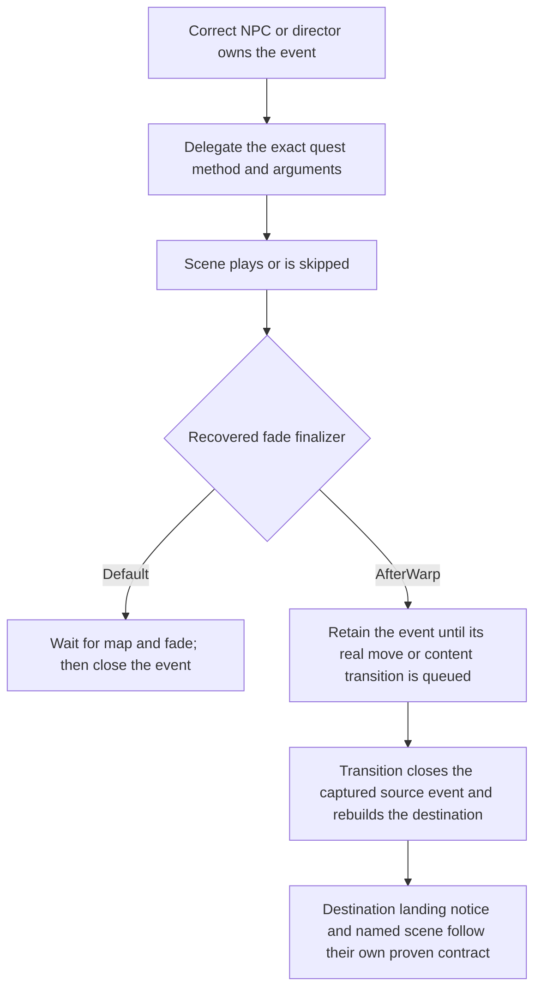

# Job and Grand Company quests: full requested decomp pass

Date: 2026-09-07. Scope: **all 87 quests in the supplied objective**—42 job quests and 45 Grand Company quests. This pass reconstructs their available client scenario code, follows the shared cutscene/event protocol, decodes the complete actor/block/clip structure of every referenced scene, and audits the current server interpretation against the original journals and text.

The result is an evidence-backed implementation contract. The recovered client contains presentation methods and some director UI logic; it does not contain the lost server's complete quest dispatcher, combat AI, spawn tables, success conditions or persistent return points. Those boundaries are identified per quest, rather than being filled with invented retail behavior. The server quest implementations and availability settings were not changed by this pass.

## Start here

- [Complete index of all 87 quests](../outputs/job-gc-decomp-20260907/QUEST_INDEX.md): each quest links to its entire readable method reconstruction and scene resources.
- [Warrior, Monk and White Mage: 18 quests](job_war_mnk_whm_decomp_2026-09-07.md): event chronology, dialogue ownership, original objectives, actor bindings, rewards, and scene tracks.
- [Black Mage, Paladin, Bard and Dragoon: 24 quests](job_blm_pld_brd_drg_decomp_2026-09-07.md): exact argument branches, pre/post-battle corrections, AF interactions, reward identities, and typed player placements.
- [Grand Company: 45 quests](grand_company_requested_decomp_2026-09-07.md): all three cities, campaign history arguments, enlistment confirmation, dungeon briefings, battle devices, protection objectives, merit UI and promotion.

The [artifact README](../outputs/job-gc-decomp-20260907/README.md) explains the file formats. The [scope ledger](../outputs/job-gc-decomp-20260907/scope.csv) retains every ID, title, level, and current availability row. A prior label such as “Implemented” is an audited input, not proof that a private adapter recreates every original encounter mechanic.

## Coverage and confidence

| Surface | Result |
| --- | ---: |
| Requested quest chunks | 87 / 87 |
| Non-init methods, including reminder and widget helpers | 880 |
| Scenario instructions | 33,187 |
| Reachable scenario instructions interpreted | 32,966 / 32,966 |
| Conditional branch edges covered | 646 / 646 |
| Readable symbolic path templates | 1,364 |
| Repeating-menu terminal templates | 72 |
| Structurally unreachable compiler-emitted JMP/RETURN instructions | 221 |
| Matching director chunks inventoried and disassembled | 48 |
| Literal scene callsites | 61 |
| Referenced installed scene resources structurally decoded | 51 / 51 |
| Complete serialized actor slots | 768 |
| Authored timeline blocks | 967 |
| Typed clip records | 18,517 |
| Typed SetPosClip records across all blocks | 3,272 |
| Initial class-bound proxy placements | 398 |
| Methods calling the after-warp finalizer | 29, across 17 quests |

The three detailed reviews account for every method: WAR/MNK/WHM **199 methods / 225 templates / 46 branch edges**; BLM/PLD/BRD/DRG **239 / 279 / 72**; GC **442 / 860 / 528**. `Gcg101` and `Gcu101` contain only an empty `initText` under `ScenarioBaseClass`; they contribute zero event methods. There is no recovered inheritance from `Gcl101` in those chunks. The raw registration is retained so this cannot be mistaken for a missing extraction.

The symbolic evaluator executes only the ten opcodes observed in the scenario scope. Every external API remains an inert boundary. Independent return symbols prevent separate questions from accidentally sharing a choice, and preserve the two results of the GC confirmation widget. Branch constraints distinguish nil, boolean false/true, and numeric 0/1. The one numeric ordering branch includes its exact inclusive threshold.

These counts establish code-flow coverage, **not live-client or retail encounter parity**. Repeated menus have explicit loop-back templates rather than an impossible enumeration of every menu history. External API values are uninterpreted; paths can describe combinations that the game's unseen state producer would never supply. All root registrations and `initText` methods are disassembled even though they are excluded from the event trace count. Unsupported opcodes, malformed tables, invalid clip references and incomplete block parsing stop the generator.

## Findings that materially change implementation

| Quest or surface | Recovered correction | Consequence |
| --- | --- | --- |
| Paladin 30, `Pld0j1` | Journal Wil/514 puts `pld0j110` and crystal 11000558 after the last enemy dies. `processEvent010` and `015` are two wrappers for that aftermath. | The current `preEvent = processEvent010` is in the wrong phase. Use a success-owned aftermath with its matching fade/transition contract. |
| Black Mage 40, `Blm0j3` | `processEvent000` is Lalai's reminder to find Kazagg; `processEvent005` is Kazagg's introduction and accepts the race-format argument. | Bind the actual introduction to Kazagg and supply the proven race argument. Merely finding the method name in the class does not validate its speaker. |
| Warrior 30, `War0j1` | `processEventClearAfter` contains Neale's post-completion pirate dialogue. | Do not automatically speak it through Curious Gorge at the reward interaction. |
| Warrior 50, `War0j6` | The active journal's final objective says to speak to Gorge again at the Silver Bazaar. The cave reminder sends the player there. | The cave marker does not prove a post-battle return point or reward placement. Keep the destination-owned Gorge interaction. |
| Monk 50, `Mnk0j6` | Finale dialogue and AF presentation belong to Widargelt; Erik's follow-up tells the player to speak to Widargelt. The raw director inherits `QuestDirectorBaseClass`. | An Erik-based private adapter is a fidelity limitation; it is not evidence for the original scene speaker or SimpleQuestBattle inheritance. |
| White Mage 30, `Whm0j1` | `processEventClear` leaves the talk turn open; `ClearNQ` performs the close and cinematic handoff. | Preserve the paired ownership instead of inserting an arbitrary close between the methods. |
| White Mage 50, `Whm0j6` | Firebound Wrath resolves to combat class 2204610 / display 3204607. Other named elemental displays do not by themselves prove corresponding actor classes. | Recover this exact identity while retaining the unresolved mob profiles, allied behavior and other elemental bindings. |
| GC enlistment, `Com0[lgu]7` | One confirmation widget returns a boolean result and a separate numeric answer. The FAQ is a real repeating menu. | Do not replay the duplicated calls or infinite-looking loop emitted by damaged pretty-printed Lua. Rank 11 is presentation evidence; the server still owns the transaction. |
| Level-40 GC battles, `G*102` | Limsa, Gridania and Ul'dah respectively require devices 11000423, 11000422 and 11000421. Gridania asks the player to defend wounded NPCs while they recover. | Implement the distinct reinforcement/poison/status mechanics. “Two Vans” does not establish a moving two-vehicle escort. |
| GC shared inventory | `Gcl101`'s Gridanian offer is not the Limsa offer, and `Gcu102`'s middle Echo scene is not its completion. | Carry speaker and journal-stage evidence into dispatch tables. A literal-method validator alone misses these errors. |
| Party size | “Three companions” means four total participants; some finales explicitly allow seven companions. | Preserve the source's recommendation versus maximum distinction. A smaller private-adapter cap must not be labelled recovered retail behavior. |
| Reward labels | Item 3020410 is The Keeper's Hymn. Action 27316 is Burst; 27148 is Hallowed Ground. | Correct misleading descriptions without conflating an incorrect comment with an incorrect numeric grant. |

The group reports include exact method PCs, byte offsets, source journal references, item/actor IDs, and the remaining boundary for each quest, including the AF-coffer routes and currently inert campaign shells.

## The before/after-battle warp contract

The shared [raw client helpers](../outputs/job-gc-decomp-20260907/shared/manifest.json) establish the ABI beneath the quest-specific methods:

```text
eventOwner:delegateEvent(player, quest, method, ...)
    -> quest:_callFunction(method, player, eventOwner, ...)

quest:startNQCutScene(sceneKey, mode, ...)
    scene = worldMaster:createCutScene(sceneKey, quest)   -- exactly once
    finished, result = scene:startCutScene(1, 61, mode, ...)
    if finished == true then scene:_delete() end
    return result

default fade-out:  player:_fadeOut(1); player:_waitForFading()
default fade-in:   player:_waitForMapLoaded(nil)
                  player:_fadeIn(1); player:_waitForFading()
after-warp exit:   player:_fadeInAfterWarp()
                  -- the client "test" zone substitutes the default fade
```

The create/delete behavior above is from `QuestBaseClass_common` PCs 0–18, file offsets `0x776–0x7BE`. The damaged decompile duplicates the scene construction in the deletion expression; the raw register R6 preserves the same scene object. The default fade-in is at `0xEEE–0xF12`; the after-warp helper is at `0x1042–0x1072`. Its normal-path native call occurs at `0x106E` and does **not** contain a zone ID or destination coordinate.

`CutScene.startCutScene` enters the native loading-clear wrapper before loading/playing its scene. The skip widget's accepted answer invokes `_skip()` on that same scene actor and then hides the widget. It does not create an independent quest-level “skip succeeded” path. The delegated playback return must therefore preserve the same transition ownership whether the player watches or skips.

The practical sequence follows the recovered finalizer, not the method suffix:



The current server's `Player.EndEventWithType` queues the close and immediately clears owner/name/type/running-event state. It is not a harmless cosmetic fade reset. `DoPlayerMoveInZone` ordinarily publishes an in-zone move without closing an unrelated quest event; content/cross-area transitions have a staged source-close and actor-rebuild path. Preserve which component owns the actual close rather than assuming that calling any movement function has identical side effects.

The [current lifecycle contract](content_cutscene_lifecycle_contract.md) and [earlier MSQ skip investigation](msq_man304_308_402_406_cutscene_skip_decomp_2026-08-21.md) provide useful working comparisons. The Man406 case distinguishes landing readiness, director membership, content-group publication, and the named movie. Its loading-clear wrapper is `questBaseRewardSeting`: native notice loading clear, default fade, then wait 0.5 seconds. Its name does not authorize a reward grant.

Do not apply Man406's deferred membership rule to every duty; some recovered InstanceRaid/Occupancy consumers need the content envelope before the scene. Likewise, a reconnect branch that omits a source movie must not manufacture that movie's after-warp finalizer. The prior case evidence documents an extra loading owner hiding an otherwise playing movie.

### Current adapter discrepancy to carry forward

The job template invokes a configured `preEvent` before creating its private shell. The shared squad launcher then performs `StartContentGroup(); player:EndEvent(); DoZoneChangeContent(...)`. That unconditional early close deserves correction for any genuine after-warp lead-in once its route phase is correct. Paladin 30 first needs the chronology correction above; mechanically preserving its current misplaced intro would still be wrong.

The squad success path is different: it kicks a director-owned event, delegates `successEvent`, retains the owner event, and returns the member through `ExitCurrentContentToReturnPoint`. This is a useful lifecycle example, but the current success delegate supplies no extra payload. The Limsa familiar aftermath has a forwarded argument whose original producer remains unproved. Correct event lifetime and correct argument values are separate requirements.

Sources for these working-tree observations are `Data/scripts/quests/job_quest_template.lua`, `Data/scripts/quests/com/gc_sqb_quest.lua`, `Data/scripts/directors/Quest/gc_sqb_runtime.lua`, `Map Server/Actors/Chara/Player/Player.cs`, and `Map Server/WorldManager.cs`. No live packet capture or watched/skipped/reconnect playtest was performed for these 87 quests in this pass.

## Placements: the deeper decoding correction

The old setup decoder assumed a 0x40-byte record held position floats and used fixed actor-kind numbers. Both assumptions are unsafe across this scope. The new decoder follows the installed scene's PWIB → SCB → String pool → CATT/CCPT descriptors → CACT slots → CBLK records.

Native loaders **FUN_00a271b0** and **FUN_00a27210** resolve the actor and clip descriptor names through per-resource string indices. The [native evidence note](../outputs/job-gc-decomp-20260907/reviews/gc/actor-clip-registry-native.md) records source hashes, C excerpts, and executable addresses. A numeric type index is not a global actor or clip enum. The low descriptor byte is preserved without an invented meaning.

The class-bound PC/NPC records are serialized `ProxyActor` slots of size 0x3C. `CharacterActor` is a different scene type and can be a stage without an actor-class ID. Duplicate labels are retained by slot and dictionary offset. This matters for repeated `SPIDER_CHILD_RA`, `FIGHTER_GLADIAT`, and `POPULACE_FST_CO` labels.

Only a descriptor-resolved `SetPosClip` is decoded as a placement. Four initial records that a size-only reader would call coordinates are rejected:

| Scene | Outer file offset | Real clip class | Controlled slot |
| --- | --- | --- | --- |
| `com0u105` | `0x522DC` | `IfClip` | camera |
| `gc01u210` | `0x17D394` | `IfClip` | camera |
| `pld0j520` | `0x6C588` | `LocalCameraClip` | camera |
| `pld0j620` | `0x1D2A4` | `IfClip` | PC |

The last record's integer fields become tiny denormal floats when misread as coordinates. A plausibility check such as “all values are finite” does not catch it. The [rejection ledger](../outputs/job-gc-decomp-20260907/rejected-size-only-placements.csv) and semantic tests preserve these counterexamples.

`com0g610` has a valid initial block named **header**, not `setup`. Its declared block entries recover 50 SetPos clips, including the common stage, through structural parsing. The absence of the word `setup` was a decoder limitation, not missing scene data.

The [initial bound-proxy placements](../outputs/job-gc-decomp-20260907/scene-placements.csv) and [all authored SetPos records](../outputs/job-gc-decomp-20260907/scene-timeline-placements.csv) intentionally answer different questions. Zero or absent setup positions do not prove an actor never moves: `blm0j110` and `pld0j620` place the PC in later blocks; WHM50 supplies elemental and PC staging later in the movie. The full records retain block labels, local start times, target tracks, flags and offsets.

A last-in-file pose is not automatically the played branch's final pose, and a scene pose is not automatically the server's post-movie position. Binding, parent transforms, conditional branches and moving tracks remain relevant. A valid world warp still requires a proven zone/map frame, the applicable transform, route phase and server owner. Journal X/Z markers can corroborate a destination but do not supply a unique persistent actor, terrain Y or battle-success rule.

## Reproduction and validation

```powershell
python tools/build_job_gc_decomp.py
python -m unittest discover -s tools -p test_job_gc_decomp.py -v
```

The generator requires the recovered Lua corpus and installed 1.x client; `--client-root` and `--output` can select alternate locations. `--skip-scenes` emits scenario/director/shared-helper evidence only. It copies no original installed scene packages and executes no game API. [Source hashes](../outputs/job-gc-decomp-20260907/source-manifest.json) anchor the input chunks, scene resources and extraction dependencies.

Fourteen regression tests check strict Lua booleans, independent BLM questions, GC two-result confirmation, menu back edges, the inclusive level-45 comparison, empty city-class shells, argument forwarding, unsupported-opcode rejection, complete reachable-instruction coverage, per-scene actor descriptors, repeated actor labels, the header-named block, and the false-coordinate counterexamples.

The WAR/MNK/WHM review independently recorded every method's ordered API calls and matched all 199 against the universal extraction with zero mismatches. The other reviews independently checked raw branch methods, journal expressions, scene records and source identities. The delivered group reports have verified local links and coverage for every assigned quest.

What remains unavailable is stated at the actual boundary: missing retail server dispatch and encounter data, unproved persistent placements, unknown argument producers, some original mob profiles/AI and battle ownership, and live watched/skipped/reconnect behavior. The complete available-client decomp and these implementation findings are ready for the next implementation pass.
