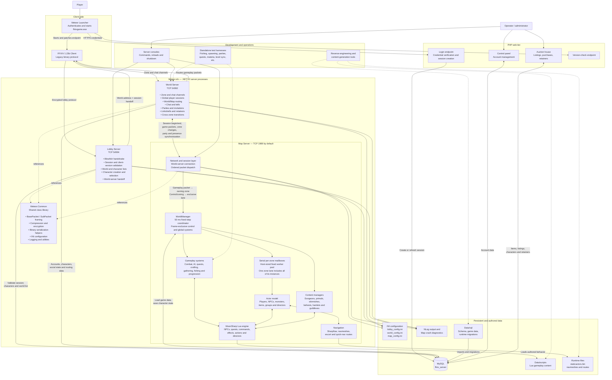
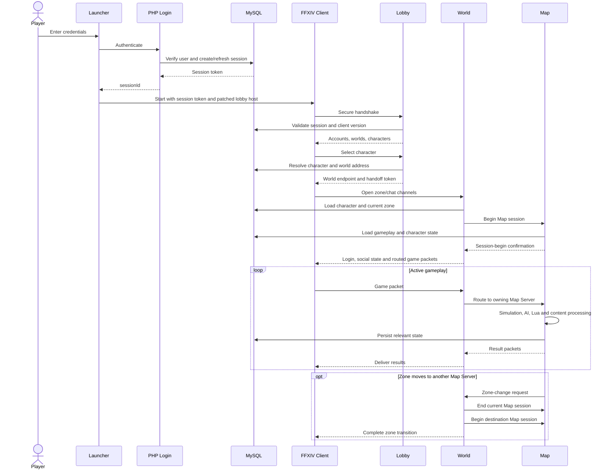

# Project Buried Memory application architecture

This document describes the runtime architecture of the FFXIV 1.23b server emulator, including the launcher and web-login boundary, the three .NET server processes, shared persistence, authored Lua content, and supporting operational tools.

## System architecture

## Login and gameplay flow

## Responsibility boundaries

- **Lobby Server** owns authentication handoff, client-version validation, world discovery, and character selection and management.
- **World Server** owns global sessions, social systems, chat, and routing between clients and Map Servers.
- **Map Server** owns authoritative gameplay simulation, zones, actors, combat, scripted content, and most character-state persistence.
- **MySQL** is the shared persistent store for every server process and the PHP web tier.
- **Lua scripts** provide authored gameplay behavior inside the Map Server through MoonSharp.
- **Meteor.Common** defines shared packet framing, compression, encryption, serialization, configuration, logging, and utility behavior.

## Configuration and scaling notes

- Lobby Server listens on TCP port `54994` by default.
- World Server listens on TCP port `54992` by default.
- Map Server listens on TCP port `1989` by default.
- `servers` rows determine the World endpoint returned to the client by Lobby Server.
- `server_zones.serverIp` and `server_zones.serverPort` assign zones to Map Server processes. World Server groups rows by endpoint and connects to each configured Map Server.
- Multiple Map Server processes can therefore own different sets of zones while one World Server maintains global session and social state.
- Lobby and World packet dispatchers use every logical processor available to their processes. Per-connection drains preserve packet order; World session/name registries and Lobby connection cleanup have explicit cross-connection synchronization.
- Inside each Map Server, `zone_worker_count=0` uses every available logical processor up to the owned-zone count. Values `2-256` set an explicit per-zone worker count, while `1` selects the guarded legacy timer as an operational fallback.
- The 50 ms coordinator schedules different zones concurrently, but each zone and all of its private/content instances own one serial mailbox. A frame barrier completes all zone work before global managers run, and missed deadlines are skipped rather than overlapped or replayed.
- Gameplay packets are synchronously routed through the player's current zone mailbox, preserving World-connection packet order. Login/logout, hard zoning, content entry, disconnected-session recovery, and other cross-zone mutations use the frame-exclusive lane.
- Delayed instance, director, mob-event, Lua `Wait()`/signal, and zoning sequences release their worker while awaiting time or client settlement. Their next state-changing phase is posted back to the same owner mailbox (or reacquires the exclusive lane for a cross-zone transition), so an `await`, timer, or signal callback never silently abandons simulation ownership. Lua timed waits are polled by the 50 ms fixed-step coordinator rather than a separate `System.Threading.Timer`, and retain the public/private/content area where the coroutine suspended.
- Database persistence that does not need an immediate result uses the bounded deferred database writer. Simulation-critical reads and transactional transitions remain synchronous so gameplay cannot observe a save or load that has not completed.
- All ports and bind addresses are configuration-driven and can be overridden by launch arguments.

## Primary implementation references

- `Lobby Server/PacketProcessor.cs` — lobby authentication, world listing, character management, and handoff.
- `World Server/Server.cs` — client connections, session routing, and Map Server packet forwarding.
- `World Server/WorldMaster.cs` — zone ownership, Map Server connections, and cross-zone transitions.
- `Map Server/Server.cs` — Map process startup, data loading, World connection, and session lifecycle.
- `Map Server/WorldManager.cs` — zones, actors, content systems, simulation, and persistence coordination.
- `Map Server/Utils/FixedStepMailboxScheduler.cs` — per-zone serial ownership, fixed workers, frame barrier, awaited-continuation affinity, and exclusive cross-zone work.
- `tools/zone-mailbox-tests` — deterministic concurrency checks for same-zone exclusion, different-zone parallelism, the exclusive frame gate, async continuation affinity, and a real public-zone/content-instance entry, ticking, re-entry lookup, return, and teardown lifecycle.
- `Map Server/Lua/LuaEngine.cs` — MoonSharp registration, authored-script execution, thread-safe wait registries, and area-affined timed/signal coroutine resumption.
- `Common Class Lib/BasePacket.cs` and `Common Class Lib/SubPacket.cs` — shared binary protocol framing.
- `Data/www/login` — PHP login, control panel, and auction-house surfaces.
- `Data/sql` — database schema, game data, and migrations.
- `Data/scripts` — Lua gameplay content.
