# Retail appearance-dirty and BODYGEAR apply path

This is a read-only reverse-engineering bundle for `ffxivgame-ifrit.exe`.
It deliberately does not include further quest Lua, WSS, or m508 animation
guessing.

Binary identity:

- PE image base: `0x00400000`
- file size: `15,996,808` bytes
- MD5: `09CD478AD1DA4379414EAD9C282F4BBD`
- SHA-256: `9341F2B4567440B310A4D494F5CC5599CA334BA51C8042247317FF466492F2E9`

## Result

The normal retail appearance path does **not** implement a BODYGEAR
crossfade. It stages one requested 0x74-byte appearance bank, optionally
waits for its asynchronous resource entry, and then directly replaces the
model helper's active fields. There is no old/new render pair, duration,
delta-time input, blend weight, alpha ramp, or transition curve in this path.

Resource readiness can delay when the replacement becomes visible. That
latency is not an authored visual transition.

This makes the next bounded target a scenario-specific effect/selector that
masks or accompanies the discrete swap, not another guessed body animation.
The generic RGBA fade code at `0x0065EF60` is separate and has no call edge
from the appearance-dirty chain recovered here.

## Exhaustive `actor + 0xB20` result

There is exactly one genuine read of the actor appearance-dirty byte in the
executable:

```asm
00585DD8  CMP byte ptr [EBP+0B20h],0
```

It belongs to `FUN_00585D70`. The first per-frame owner is
`FUN_0058DF90`, which calls it at `0x0058DFB3`; `0x0058DF90` is stored in
the CharaElement vtable at `0x00FA7C68`.

The exhaustive decoded census found 61 actor-layout accesses using the exact
`0xB20` displacement: this one read and 60 writes. The remaining raw
displacement hits are a stack `LEA`, one unrelated object's dword write, and
non-instruction byte coincidences. See
`13-b20-exhaustive-instruction-audit.txt`.

When the dirty byte is set, `FUN_00585D70`:

1. dispatches event `8` with `actor+0xAAC` and length `0x74`;
2. invokes `FUN_00585930(actor, 0.0f, 1)`;
3. sets actor byte `+0x26D` bit `0x40`;
4. clears `actor+0xB20`.

`FUN_00585930(..., 1)` is not a fade launcher. It compares the base model
against five resolved IDs and, for those special IDs, writes `0x32` to
`actor+0xAA8`. Its full decompilation is in
`15-b20-reader-callees-decomp.txt`.

## Exact event and renderer handoff

```mermaid
flowchart LR
    A["D6/D7 entry"] --> B["0x586870: write actor appearance dword"]
    B --> C["actor +0xB20 = 1"]
    C --> D["0x58DF90 per-frame"]
    D --> E["0x585D70: event 8, 0x74 bytes"]
    E --> F["0x663808 event case"]
    F --> G["0x6623F0: copy to renderer +0x13C8"]
    G --> H["0x65D730: arm +0x2B70 low nibble = 1"]
    H --> I["0x666720: queue/poll readiness"]
    I --> J["0x665E40: apply one bank"]
    J --> K["vtable +0x64 = 0x6B7840"]
    K --> L["0x6B6850: build one part resource ID"]
```



The event-8 CharaActor case at `0x00663808` calls `FUN_006623F0`.
`FUN_006623F0` copies exactly 29 dwords to renderer `+0x13C8` and calls
`FUN_0065D730`.

`FUN_0065D730` is a backfill/phase-arm routine. It copies requested fields
to the first bank only where the first field is zero, then sets the low
nibble of renderer `+0x2B70` to `1`. This is value staging, not two rendered
models.

The real phase routine is `FUN_00666720`, called at `0x006680C6` by
renderer per-frame method `FUN_006679C0`. The earlier `0x0065F412` and
`0x0065F423` sites are constructor-time bank initialization and are not the
runtime transition.

On the next eligible renderer tick, `FUN_00666720` changes phase `1 -> 0`,
submits the one requested bank through `FUN_007D1C80`, polls readiness via
`FUN_007D1AF0`, obtains the ready bank through `FUN_007D1B30`, and calls
`FUN_00665E40`. Queue-submission failure takes a synchronous fallback call
to the same `FUN_00665E40` apply function.

## Correct BODYGEAR indexing

The 0x74-byte native block includes base-model field 0. Server logical
appearance index 13 (`BODYGEAR`) is therefore wire field 14 and native block
dword 14, not dword 13.

| Layer | BODYGEAR location |
|---|---:|
| logical server array | index `13` |
| D6/D7 wire field | `14` |
| actor block | `actor+0xAAC + 14*4 = actor+0xAE4` |
| renderer first/base bank | `renderer+0x138C` |
| renderer requested bank | `renderer+0x1400` |
| apply-bank relative offset | `+0x38` |
| model helper active field | `helper+0x9C` |

The decisive assignments are:

```asm
0065D856  CMP dword ptr [ECX+138Ch],0
0065D85F  MOV EAX,[ECX+1400h]
0065D865  MOV [ECX+138Ch],EAX

006B78F8  MOV ECX,[EAX+38h]
006B78FB  MOV [ESI+9Ch],ECX
```

`FUN_006B6850` then consumes helper `+0x9C`, decodes the packed gear word,
and submits one BODY part resource ID to `0x00CA7D70`. The curated package
uses this verified field-14 mapping throughout and supersedes exploratory
temp notes that treated the logical index as the native block index.

## `actor + 0xB1C` bits 0, 1, and 2

No instruction directly `TEST`s or `CMP`s actor memory at `+0xB1C` against
bits 0, 1, or 2. Actor-side functions assemble the word; two serialization
functions read the whole word; event 8 copies it as dword 28 of the 29-dword
appearance block. The downstream renderer then interprets its copied value.

| Actor flag | Proven downstream use | Conservative interpretation |
|---|---|---|
| bit 0 | passed to all seven equipment entries; `FUN_00846590` maps it to entry flag `0x20000`; `FUN_006B7840` maps it to model-helper `+0x40` flag `0x2000` | equipment/model apply mode; exact English name unknown |
| bit 1 | copied to renderer `+0x2830` bit `0x2`; getter `FUN_0065BB20` gates the only direct caller at `0x00832470` | enables extra attachment/bone-name fan-out for `b_base_kami`, `b_base_skirt`, `b_base_maedare`, and `b_base_pch`; not a fade flag |
| bit 2 | mapped by `FUN_006B7840` to model-helper `+0x40` flag `0x4000`; tested at `0x006B5D41` and `0x006B60D9` | selects supplemental `%s9998.bin` resource attempts (slots `0xD`/`0xE`); not a blend flag |

`FUN_0065D730` conditionally backfills only bits 0 and 1 into its first-bank
flag word. The requested bank still carries the full source flag dword to
`FUN_00665E40` and `FUN_006B7840`, where bit 2 is consumed.

The bit-1 getter has one direct call, `0x00832470`. Its containing function
compares the attachment name to the four strings listed above and expands
additional formatted attachment names before forwarding the original name.
The complete decompilation and raw windows are in
`16-b1c-renderer-bit-consumers.txt`.

## `0x58EBD0` and `0x58EBB0`

The caller census is exhaustive for initialized executable content:

- `0x0058EBD0` has one direct call, `0x0058D10E`, and is a leaf.
- `0x0058EBB0` has one direct call, `0x0058D14E`, and is a leaf.
- no `E9` tail call and no initialized absolute function pointer to either
  helper was found.

Exact arguments:

```text
0x58EBD0(this=actor in EDI, x=1)

0x58EBB0(
    this=actor in EDI,
    x=FUN_00443E40(
        this=FUN_004D73B0([actor+0x7C]),
        7, 0x1E, 0))
```

Only `x & 1` survives. `0x58EBD0` replaces B1C bit 1; `0x58EBB0`
replaces B1C bit 0; both set B20. The D6/D7 arm then clears B1C bit 2.
Its net flag state is:

```text
bit 1 = 1
bit 2 = 0
bit 0 = FUN_00443E40(..., 7, 0x1E, 0) & 1
B20   = 1
```

## Bundle map

- `01-xref-and-flags-report.md`: exhaustive B20/B1C and helper-call census.
- `02-helper-caller-callee-census.txt`: compact Ghidra reference census.
- `03-raw-b20-b1c-listings.txt`: raw bytes around actor reads/mutations.
- `04-d6-d7-callers-callees-decomp.txt`: D6/D7 switch arm and both helpers.
- `05-actor-flag-consumers-decomp.txt`: actor flag import/serialization functions.
- `06-frame-and-model-apply-decomp.txt`: requested full decompilations of the actor tick, renderer tick, apply wrapper, and model methods.
- `07-b1c-source-functions-decomp.txt`: all main actor-side B1C mutation functions.
- `08-event-handoff-decomp.txt`: event transport and CharaActor dispatch path.
- `09-resource-queue-decomp.txt`: submit/readiness/retrieval queue functions.
- `10-renderer-state-machine-report.md`: focused independent renderer synthesis.
- `11-renderer-focused-full.txt`: full focused Ghidra output and listings.
- `12-renderer-and-property-consumers-decomp.txt`: broader renderer/property consumers.
- `13-b20-exhaustive-instruction-audit.txt`: every decoded `0xB20` displacement.
- `14-appearance-setter-and-d6-d7-decomp.txt`: `0x586870` and packet handler.
- `15-b20-reader-callees-decomp.txt`: B20 reader plus `0x585930` and event publisher.
- `16-b1c-renderer-bit-consumers.txt`: bit-1 attachment gate and bit-2 `%s9998.bin` branches.
- `17-call-graph.md`: caller/callee inventory for the recovered path.
- `18-curated-raw-read-windows.md`: short raw-byte windows for verification.

No server source file was changed to produce this bundle.
