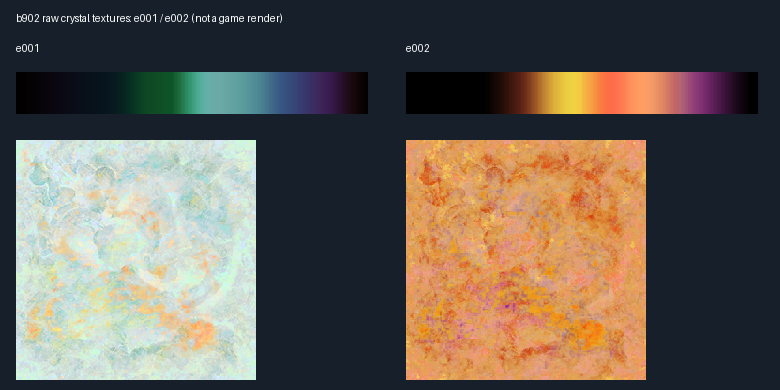

# Atomos event: aetheryte animation and appearance recovery

Date: 2026-09-07. Scope: installed client `b902 e001/e002`, `b903 e001`, and `b904 e001`; read-only extraction. This extends the July 29 Atomos report using embedded resource parsing and texture decoding. It does not modify the client or server.

## Findings that change the earlier interpretation

1. **The full camp aetheryte does have a skeletal idle motion.** Its model embeds `initf_idle`, which selects the `cbnm_id0` motion and `b_902vfx1` effect action together. No external `/act/` bank does not mean no animation. The earlier directions “The camp crystal itself does not have a skeletal action bank” and “Do not animate its skeleton” should be replaced with: preserve the embedded idle animation; no separate drain-specific motion has been identified.
2. **`b902 e002` supplies actual orange crystal textures.** Its main crystal shaders use `o_aet2_aetl1_1h` / `o_aet2_aetl2_3h`, a warm orange/yellow fuzz ramp `w_aet2_aetl1_fz`, and an orange diffuse texture `w_aet2_aetl2_ch`. `e001` uses corresponding `aet0` cyan/pale textures. This is direct asset evidence for an authored orange variant and makes `e002` the strongest concrete candidate for the historically affected camp crystal.
3. **The e001 and e002 embedded VFX and idle motion payloads are byte-identical.** Their color difference therefore cannot be attributed to a different embedded drain animation or different `b902_vfx` graph. Their crystal shaders/textures are different. The orange variant's exact original event/camp binding still requires packet or live evidence; texture recovery does not recover the director's state transition.
4. **The supplied third screenshot is a different question from the persistent orange crystal.** Its crystal remains blue while a bright orange-white flare and radial lines occur below it. A still image cannot establish that this flare belongs to Atomos, the crystal, or an overlapping player/target action. Do not turn the whole crystal orange as an explanation for that particular frame. The transient ground flare remains unbound.



This image displays decoded texture pixels only, enlarged with nearest-neighbor sampling. It is not a reconstruction of the game renderer or an identification of the screenshot's ground flare.

## Exact embedded scheduler and motion recovery

| Resource | Embedded scheduler | Motion | Authored transform header | Effect action |
|---|---|---|---|---|
| `b902 e001` | `initf_idle` | `cbnm_id0` | 1,728 frames, 30 fps, 10 bones; 57.6 seconds | `b_902vfx1` |
| `b902 e002` | `initf_idle` | Same MCB and MTB bytes as e001 | Same | Same action/VFX bytes as e001 |
| `b903 e001` | `initf_idle` | `cbnm_id0` | 1,600 frames, 30 fps, 8 bones; 53.333... seconds | `b903_01v` |
| `b904 e001` | `initf_idle` | None in this embedded scheduler | No MCB/MTB found in this model payload | `b904_01vfx` |

The `b902` timeline starts `BindActorClip`, `RaptureSoundClip`, `ActionClip(b_902vfx1)`, and `MotionClip(cbnm_id0)` at raw tick zero. `RaptureChantSyncClip` starts at raw tick 10,000. The single authored block has duration 17,290,000 raw units; the MCB motion-command block has duration 17,280,000 raw units and one `MotionCommandClip`.

The MCB duration equals 1,728 frames times 10,000. Treating 17,280,000 as microseconds would produce 17.28 seconds, contradicting the explicit 30-fps MTB header's 57.6 seconds. This report therefore preserves SCB/MCB timings as raw units and publishes seconds only from the MTB frames/fps header. The older census's mechanically calculated `/ 1e6` fields are deliberately omitted from this extraction's scheduler JSON.

All four model payloads have only an `initf_idle` scheduler. There is no additional drain-named scheduler, `ex...` sibling, embedded `RaptureCharaColorFadeClip`, or `RaptureCharaNodeGroupMaskClip` selection in these four scheduler graphs. This negative finding is scoped to these payloads, not all possible externally driven effects.

### Exact b902 motion hashes

| Payload | Bytes | SHA-256 |
|---|---:|---|
| `cbnm_id0` MCB, both variants | 512 | `72f4a4c956d3ca2b0140ecba40535a01e077262bedbc6214578b4143e5afafdc` |
| `cbnm_id0` MTB, both variants | 48,593 | `0820320836408f910c4b8e1f7233cdc5e2e80cda4ef7cbc2421e80e26a26af4c` |

The real motion payloads are extracted for subsequent curve conversion. This pass parses their command/header structures, not every transform curve or a rendered crystal animation.

## Crystal glow resource chain

The exact resource-ID chain in both full camp crystal variants is:

```text
initf_idle
  ActionClip -> b_902vfx1 (SEDBACB)
    -> 4rRK71vleafinst (SEDBvins)
      -> 1lAxpcb_902vfx1 (SEDBleaf), referenced four times
        -> 3C0VfGb902a_vfx (SEDBveff)
        -> 2IQybsb902_vfx (SEDBveff)
```

The VINS contains four `__LeafInstance_Id__0..3` names and `ActorBind` class metadata. Its bone-name strings are `n_hara`, `n_bit_a`, `n_bit_b`, and `n_bit_c`, consistent with effects bound to the principal crystal and its three satellite pieces. The exact numeric instance-to-bone mapping has not been decoded, so this remains an authored binding-vocabulary result rather than a complete attachment-structure conversion.

| b902 effect payload | SHA-256 |
|---|---|
| `b_902vfx1` | `8ec15c7957f98f9b60fb1a002ca834dca28ffaafa91de9b33203714eb6ce34ba` |
| `4rRK71vleafinst` | `fdb9f4e2aa4186fae05f4fb0fc7b97f9f78e8fc0ed28cc6d04f31933d7648331` |
| `1lAxpcb_902vfx1` | `6bff5ef44ebba537fb84d5eba447366010ceec47a224de9ef25492b0b6616dc4` |
| `3C0VfGb902a_vfx` | `0f0ab03ac5964246b6aae9927cb305caed08a428d4238043144440a01c298429` |
| `2IQybsb902_vfx` | `d5ad5bf2400fb39231af63ac72054d0f5b69549b3badd8d528df02700c72777a` |

These graphs contain color, position, scale, generated-position, matrix, draw-resource, and leaf-lifetime control vocabulary. They are animated effect graphs, not static image attachments. Their exact final color/lifetime in the renderer cannot be inferred from class-name presence alone.

`b903` instead selects `b903_01v -> 1qO1qGvleafinst -> 2hV8njb903e01v -> 4F3gxKb903_ef1`. `b904` selects `b904_01vfx -> 1VWoI0vleafinst -> 2n5Ek8b_902vfx1 -> 4jQUD0b902a_vfx / 3uyOoQb902_vfx`. The reused `b902` substrings in `b904` effect names do not make it the orange camp variant; `b902 e002` now offers much stronger direct appearance evidence.

## Authored orange appearance

The current SQL appearance row `1280057` uses model base `20902` and body `2048`, selecting `b902 e002`. The known normal appearance row `1200013` uses model base `20902` and body `1024`, selecting `b902 e001`. The existing `spawnbgmodel.lua` table exposes both exact appearances:

```text
!spawnbgmodel b902 e001
!spawnbgmodel b902 e002
```

These are existing review commands, not a newly installed runtime change. Row `1280057` is an `AetheryteParent`, but its mere presence does not establish which Atomos camp/time used the variant.

The texture package uses a PWIB shared pixel buffer with individual `SEDBtxb/GTEX` mip descriptors. Both mip offsets and lengths were validated before decoding; normal/depth-like texture maps were retained as evidence and are not mistaken for diffuse colors.

| Crystal texture, top_tex1 mip 0 | Width × height | Pixel payload SHA-256 |
|---|---:|---|
| e001 `w_aet0_aetl1_fz` | 256 × 1 | `04a25c886739b640d9cdabd38c87998bee08c306503e58e6aeed39651ce80d03` |
| e001 `w_aet0_aetl2_ch` | 256 × 256 | `ba17d2dba09d9ca0335cb0a35e4e708187ee2abfba717793aea72d613a7311f1` |
| e002 `w_aet2_aetl1_fz` | 256 × 1 | `1e67b5c4f56b68f58d54de9dc7dcdcec2b2d9f8bafd14dd0cce9170c2dcc08c5` |
| e002 `w_aet2_aetl2_ch` | 256 × 256 | `7a0c9267a4b00d6eb54445a3b263a7f7d016ba8b93ec0ab1265d7751bac6aa90` |

The e001/e002 top-level model hashes differ, as do their shaders and mesh payloads. Their shared `CommonResource` and `caster` subcontainers are byte-identical. Their `initf_idle` SCB bytes differ, but both select the same motion/effect resources; RIDT ordering varies. Do not report the whole model or whole scheduler as byte-identical.

## Runtime and native boundary

The installed `ffxivgame.exe` was rehashed and matches the existing native scheduler audit: `9341f2b4567440b310a4d494f5cc5599ca334ba51c8042247317ff466492f2e9`.

That audit establishes `CharaActionQue` alias/direct-name resolution at `0x00844660`, a generic queue request at `0x00845E80`, and direct-name requests at `0x008460A0`. Native name-table row 1208 is `initf_idle`. It does **not** recover an appearance/model-load path that automatically submits that scheduler, or an Atomos-specific packet sequence selecting orange `b902 e002`. The presence of an embedded root and accepted scheduler name therefore is not authority to invent a new automatic server invocation.

Sources: `outputs/bgobj-model-load-invocation-contract-20260810/README.md`, `outputs/bgobj-embedded-lifecycle-contract-20260810/README.md`, and the corresponding builder in the source manifest. This is a reused, hash-matched native conclusion, not a new function decompilation in this pass.

## Practical reconstruction boundary

- Preserve the ordinary `b902` embedded idle/body motion and crystal VFX.
- Compare the existing `b902 e002` appearance directly with historical orange-crystal footage. Its authored orange textures are confirmed; its exact event binding remains a candidate.
- Keep the aetheryte's persistent appearance separate from Atomos's actor-to-actor drain presentation and the screenshot's transient ground flare.
- Do not substitute `b903`/`b904` on the strength of their related effect names, and do not declare the ground flare identified without an action/target correlation or a rendered bank match.

## Reproduction and files

From the repository root:

```powershell
python tools/decompile_atomos_aetheryte_effects.py
```

The run parses four model containers into 88 extracted resources, four embedded schedulers, six motion resources, 15 VFX dependency edges, four VINS attachment-vocabulary rows, and 64 decoded texture images from both texture-quality packages. It asserts that corresponding b902 motion/effect bytes match and that the native executable matches the prior audit.

- `source_manifest.json`: paths, byte sizes, and SHA-256 hashes of installed resources, native executable, supporting evidence, and parser scripts.
- `resources.csv` and `resources/`: recursively extracted raw resources with path/type/hash and serialized strings.
- `schedulers.json`: parsed actor, block, clip, and RIDT records; raw scheduler units only.
- `motions.json`: motion command records and explicit transform-header metrics.
- `effect_edges.csv` and `effect_attachments.csv`: serialized dependencies and attachment vocabulary.
- `b902_shared_resource_comparison.csv`: exact e001/e002 hash comparison.
- `textures.csv` and `textures/`: validated texture mip descriptors, pixel hashes, and decoded PNGs.
- `b902_texture_comparison.png`: the two crystal diffuse textures and fuzz ramps side by side.

Validation: extractor completed without parse errors; all decoded texture sizes and mip bounds were checked; the comparison PNG was opened and inspected. The parser does not render the proprietary motion/VFX graphs, and the screenshot flare remains unidentified.
